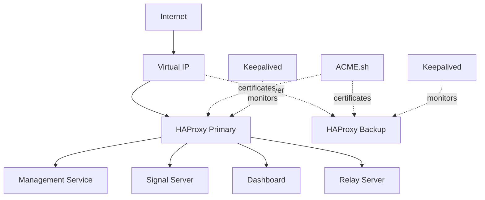

# HAProxy Autocert Validation - Implementation Notes

## Implementation Summary

This spec implemented HAProxy with automatic certificate management using ACME.sh for the NetBird infrastructure.

## Key Achievements

### Infrastructure
- HAProxy 3.2+ deployment with Docker Compose
- ACME.sh integration for Let's Encrypt certificates
- Automatic certificate renewal
- TLS 1.2+ with strong cipher suites
- Backend routing for all NetBird services

### High Availability
- Keepalived VRRP failover
- Virtual IP management
- Health check monitoring
- Automatic failover on failure

### Configuration Management
- Idempotent Ansible roles
- Template-based configuration
- Variable validation
- Production-ready defaults

## Architecture

## Technical Decisions

### Why HAProxy over Caddy
- More mature load balancing features
- Better health check capabilities
- Proven HA with Keepalived
- Fine-grained control over routing

### Why ACME.sh over Certbot
- Lightweight (shell script vs Python)
- Better Docker integration
- Simpler certificate deployment
- Lower resource usage

### Why Keepalived
- Industry standard for HA
- VRRP protocol support
- Simple configuration
- Reliable failover

## Configuration Highlights

### TLS Configuration
- Minimum TLS 1.2
- Modern cipher suites only
- HTTP/2 support for gRPC
- Automatic HTTP to HTTPS redirect

### Backend Routing
- gRPC backends use HTTP/2
- WebSocket support for real-time connections
- Sticky sessions where needed
- Graceful handling of unavailable backends

### Health Checks
- 5-second intervals
- 3-second timeouts
- 2 failures to mark down
- 3 successes to mark up

## Lessons Learned

### Certificate Management
- Always have fallback self-signed certificates
- Monitor expiry 7+ days in advance
- Test renewal process in staging
- Handle Let's Encrypt rate limits

### High Availability
- Test failover regularly
- Monitor both nodes continuously
- Use unicast mode in cloud environments
- Ensure network allows VRRP traffic

### Ansible Best Practices
- Always validate before applying
- Use handlers for service restarts
- Tag tasks appropriately
- Make roles idempotent

## Production Readiness

### Completed
- ✅ Terraform infrastructure automation
- ✅ Ansible role implementation
- ✅ Variable validation
- ✅ Documentation
- ✅ Error handling
- ✅ Logging configuration

### Monitoring Recommendations
- Certificate expiry alerts (7 days)
- HAProxy service health
- Keepalived state changes
- Backend availability
- TLS handshake errors

## References

- [HAProxy Documentation](https://www.haproxy.org/documentation.html)
- [ACME.sh Documentation](https://github.com/acmesh-official/acme.sh)
- [Keepalived Documentation](https://www.keepalived.org/documentation.html)
- [Let's Encrypt Rate Limits](https://letsencrypt.org/docs/rate-limits/)

## Maintenance

### Regular Tasks
- Review HAProxy logs weekly
- Check certificate expiry monthly
- Test failover quarterly
- Update HAProxy version annually

### Troubleshooting
See main documentation:
- `docs/runbooks/ansible-stack/troubleshooting-restoration.md`
- `docs/runbooks/ansible-stack/deployment.md`
