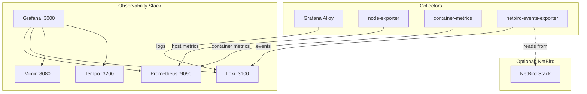
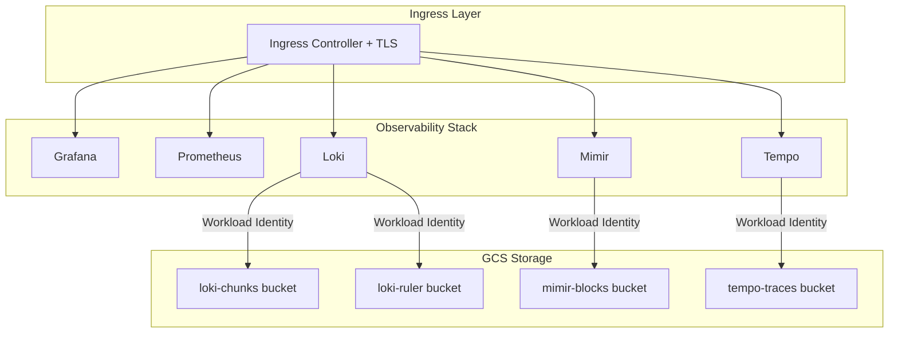

# NetBird Infrastructure and Observability

Production-grade infrastructure automation and observability stack for NetBird deployments.

## Overview

This repository provides comprehensive deployment solutions for NetBird and its supporting infrastructure:

1. **NetBird Deployment**: Complete NetBird setup with Caddy reverse proxy
2. **Observability Stack**: Production-grade monitoring with Prometheus, Loki, Mimir, Tempo, and Grafana

The observability stack is deployment-agnostic and can monitor any infrastructure, not just NetBird.

## Getting Started with NetBird

### NetBird with Caddy Reverse Proxy

Deploy a complete, production-ready NetBird instance with Caddy handling automatic HTTPS and reverse proxy functionality.

**What you'll deploy:**
- NetBird Management, Signal, and Relay servers
- Caddy reverse proxy with automatic TLS
- Keycloak for identity management
- SQlite database

See [NetBird Caddy Deployment Guide](docs/Caddy-Deployment.md) for complete setup instructions.

## Observability Stack

A production-grade monitoring solution that can be deployed alongside NetBird or used independently to monitor any infrastructure.

**Stack components:**
- **Prometheus**: Metrics collection and alerting (7-day retention)
- **Loki**: Log aggregation (30-day retention)
- **Mimir**: Scalable long-term metrics storage (30-day retention)
- **Tempo**: Distributed tracing (30-day retention)
- **Grafana**: Unified visualization dashboard

### Deployment Routes

Choose the deployment method that matches your infrastructure:

#### Route 1: Docker Compose

Single-host deployment ideal for development, testing, and small production environments.

**Includes:**
- Complete observability stack
- Optional NetBird test deployment for verification
- Host and container metrics collection
- Log aggregation from Docker and systemd
- NetBird events monitoring (when deployed with NetBird)

**Follow this guide:**
[Docker Compose Monitoring Guide](docs/Monitoring-NetBird-Observability-Docker-Compose.md)

This is a complete, self-contained route from start to finish.

#### Route 2: Kubernetes

Production cluster deployment with horizontal scalability and GCS backend storage.

**Includes:**
- Complete observability stack on Kubernetes
- GCS backend for Loki, Mimir, and Tempo
- TLS ingress with cert-manager
- Workload Identity for keyless GCS authentication
- Production-grade high availability configuration

**Follow the guide:**

[**Kubernetes Observability Guide**](docs/Kubernetes-Observability.md)
   - Automates infrastructure provisioning (GCS, IAM) via Terraform.
   - Deploys the full stack (Loki, Mimir, Tempo, Prometheus, Grafana).
   - Configures ingress and authentication.

## Architecture

### Docker Compose Deployment


### Kubernetes Deployment


## Component Documentation

### Monitoring Stack Components
- [NetBird Events Exporter](monitor-netbird/exporter/README.md) - Custom exporter for NetBird activity monitoring

### External Resources
- [NetBird Documentation](https://docs.netbird.io/)
- [Prometheus Documentation](https://prometheus.io/docs/)
- [Grafana Documentation](https://grafana.com/docs/)

## Architecture Overview

### Docker Compose Stack
```
┌─────────────────────────────────────────┐
│         Grafana (Port 3000)             │
│              Dashboards                 │
└────────────┬────────────────────────────┘
             │
    ┌────────┴────────┬──────────┬─────────┐
    │                 │          │         │
┌───▼────┐     ┌─────▼─────┐ ┌──▼───┐ ┌───▼────┐
│Prometh-│     │   Loki    │ │Mimir │ │ Tempo  │
│ eus    │     │           │ │      │ │        │
└────────┘     └───────────┘ └──────┘ └────────┘
```

### Kubernetes Stack
```
┌──────────────────────────────────────────┐
│   Ingress (TLS via cert-manager)         │
└────────────┬─────────────────────────────┘
             │
    ┌────────┴────────┬──────────┬─────────┐
    │                 │          │         │
┌───▼────┐     ┌─────▼─────┐ ┌──▼───┐  ┌───▼────┐
│Grafana │     │Prometheus │ │Loki  │  │ Mimir  │
│        │     │           │ │      │  │        │
└────────┘     └───────────┘ └──┬───┘  └───┬────┘
                                │          │
                           ┌────▼──────────▼─────┐
                           │  GCS Buckets        │
                           │  (Object Storage)   │
                           └─────────────────────┘
```

## Production Considerations

### Security
- Change default Grafana credentials immediately
- Enable TLS for all external endpoints
- Configure RBAC for Kubernetes deployments
- Use secrets management for sensitive data
- Implement network policies between namespaces

### High Availability
- Run multiple replicas for stateless components
- Distribute pods across availability zones
- Configure pod disruption budgets
- Use external load balancers in production

### Storage
- Use production-grade storage classes
- Configure appropriate retention policies
- Implement backup and restore procedures
- Monitor disk usage and set alerts

### Monitoring
- Set up alerting for component failures
- Monitor ingestion rates and storage growth
- Configure dead man's switch alerts
- Track resource usage of monitoring pods

## Troubleshooting

### Common Issues

**Pods not starting**
```bash
kubectl describe pod -n observability <pod-name>
kubectl logs -n observability <pod-name>
```

**Data source connection failures**
1. Verify pods are running: `kubectl get pods -n observability`
2. Check service endpoints: `kubectl get svc -n observability`
3. Test internal connectivity from a debug pod

**Storage issues**
```bash
kubectl get pv
kubectl get pvc -n observability
kubectl describe pvc -n observability <pvc-name>
```

See component-specific documentation for detailed troubleshooting.

## Default Retention Periods

| Component  | Retention | Configuration File |
|------------|-----------|-------------------|
| Prometheus | 7 days    | prometheus-values.yaml |
| Loki       | 30 days   | loki-values.yaml |
| Mimir      | 30 days   | mimir-values.yaml |
| Tempo      | 30 days   | tempo-values.yaml |

Adjust these values based on your data retention requirements and available storage.

## License

Component licenses:
- NetBird: BSD 3-Clause
- Keycloak: Apache 2.0
- Prometheus: Apache 2.0
- Loki, Mimir, Tempo, Grafana: AGPL-3.0
- Caddy: Apache 2.0

## Support and Contributions

- Documentation: [docs/](docs/)
- Issues: GitHub issue tracker
- NetBird: [Official documentation](https://docs.netbird.io/)
- Component docs: See respective official documentation