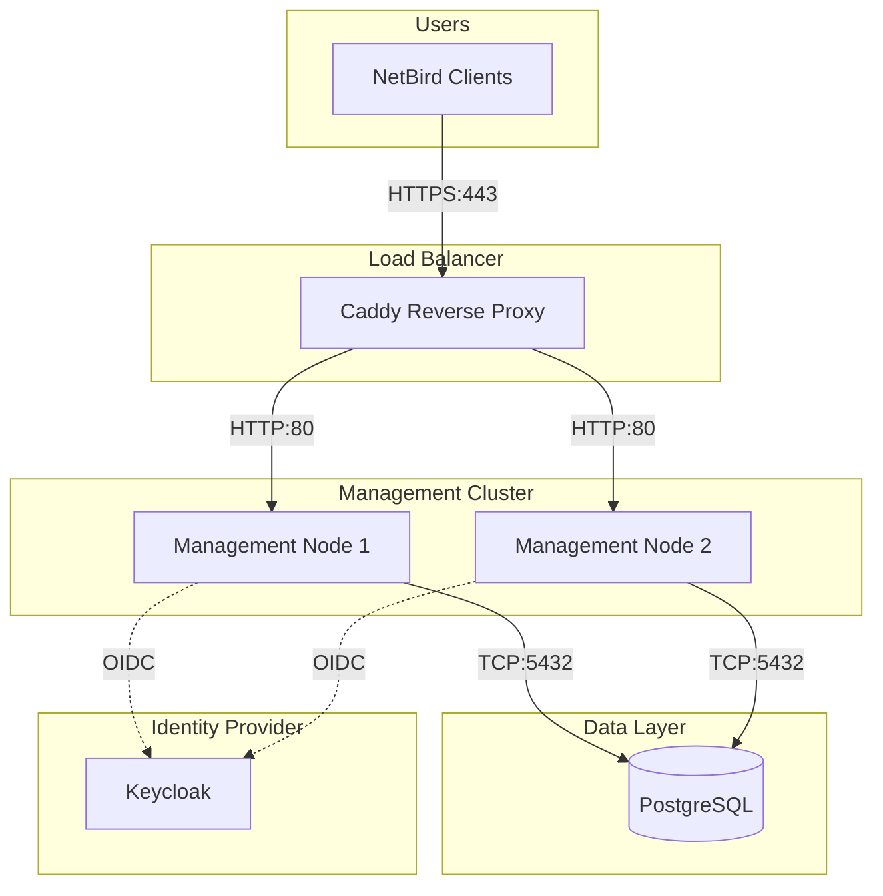
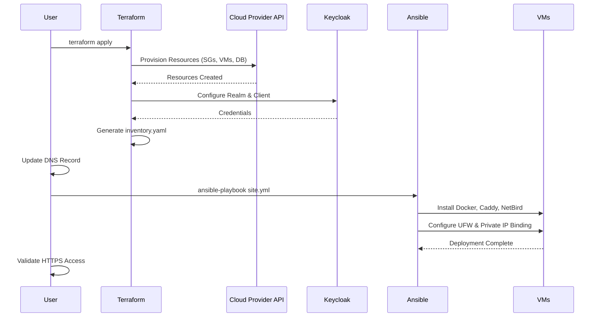

# 02 - Deployment Guide

This guide details the step-by-step process to deploy the NetBird infrastructure.

## Infrastructure Overview



## 1. Infrastructure Provisioning (Terraform)

Terraform provisions the VMs, Managed Database, Keycloak, and Security Groups.

### Steps

1.  Navigate to the infrastructure directory:
    ```bash
    cd infrastructure
    ```

2.  Initialize Terraform:
    ```bash
    terraform init
    ```

3.  Configure Variables:
    Copy the example variable file and edit it.
    ```bash
    cp terraform.tfvars.example terraform.tfvars
    nano terraform.tfvars
    ```
    **Critical Variables**:
    *   `netbird_domain`: Your DNS name (e.g., `vpn.example.com`)
    *   `cloud_provider`: `aws`, `gcp`, or `azure`
    *   `db_password`: Strong password for PostgreSQL

4.  Review the Plan:
    ```bash
    terraform plan
    ```

5.  Apply the Configuration:
    ```bash
    terraform apply
    ```
    *Type `yes` when prompted.*

### Output
Terraform will automatically generate the Ansible inventory file at:
`../configuration/inventory/terraform_inventory.yaml`

---

## 2. DNS Configuration

After Terraform completes, note the **Public IP** of the `reverse-proxy` instance (from Terraform output or Cloud Console).

1.  Go to your DNS Registrar.
2.  Create an **A Record** for your `netbird_domain` pointing to this Public IP.

---

## 3. Server Configuration (Ansible)

Ansible configures the software stack, including NetBird services, Caddy, and UFW firewalls.

### Steps

1.  Navigate to the configuration directory:
    ```bash
    cd ../configuration
    ```

2.  Run the Main Playbook:
    ```bash
    ansible-playbook -i inventory/terraform_inventory.yaml playbooks/site.yml
    ```

### Deployment Flow Diagram



---

## 4. Verification

Run the security validation playbook to ensure the deployment is secure:

```bash
ansible-playbook -i inventory/terraform_inventory.yaml playbooks/validate-security.yml
```

**What this checks:**
*   [x] Reverse Proxy has Public IP.
*   [x] Management Nodes use Private IPs.
*   [x] No critical ports exposed to 0.0.0.0.
*   [x] UFW rules are robust.

## Next Steps
Proceed to [03-configuration-reference.md](./03-configuration-reference.md).
