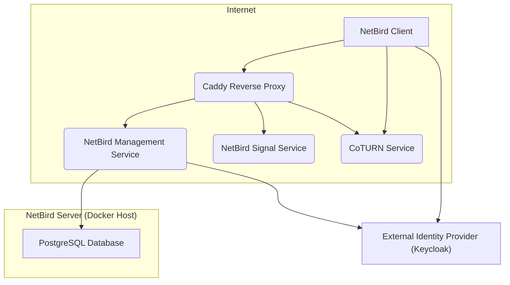
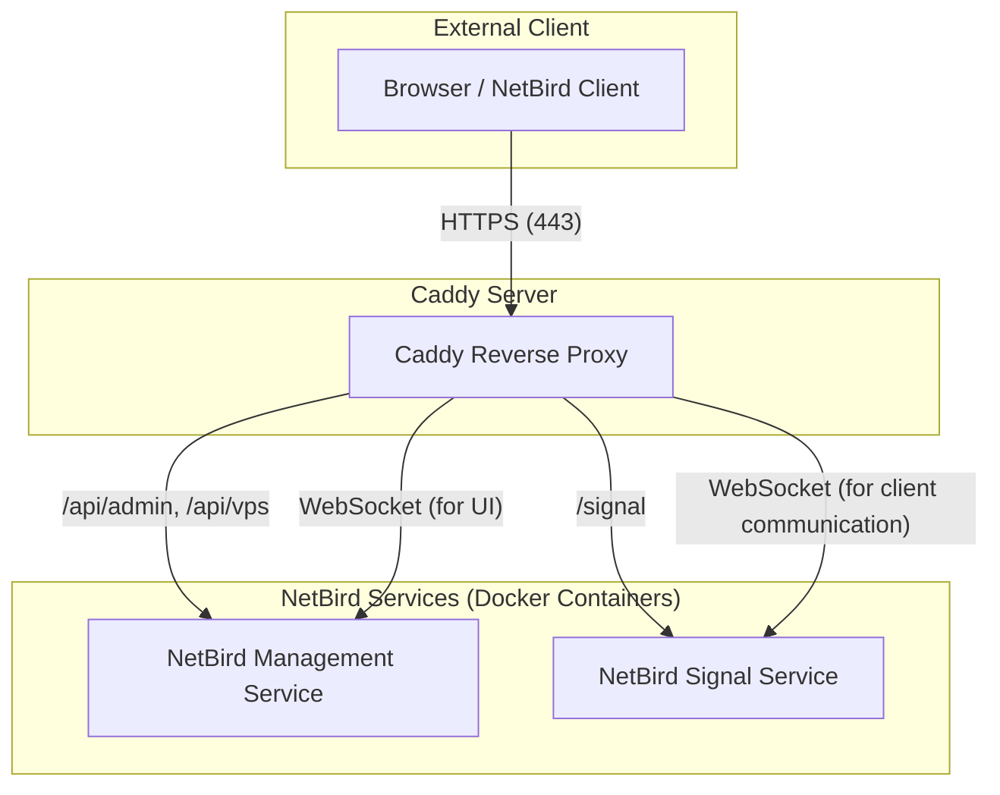

# NetBird Deployment Architecture with Caddy

This document outlines the architecture of a self-hosted NetBird deployment using Docker Compose and Caddy as a reverse proxy. The goal is to provide a secure, scalable, and easily manageable VPN solution.

## 1. Overview of NetBird

NetBird is an open-source VPN solution built on WireGuard®. It creates a secure overlay network that allows devices to communicate directly and securely, regardless of their physical location. Key components of NetBird include:

*   **Management Service**: The central control plane for NetBird. It manages users, devices, network routes, and authentication.
*   **Signal Service**: Facilitates the initial handshake and peer discovery between NetBird clients.
*   **STUN/TURN/Relay Service (CoTURN)**: Handles NAT traversal for peer-to-peer connections. If a direct peer-to-peer connection cannot be established (e.g., due to strict NATs), the TURN server relays traffic.
*   **NetBird Client**: Software running on each device that connects to the NetBird network, establishing WireGuard tunnels.

## 2. System Architecture Diagram

The following diagram illustrates the high-level architecture of the NetBird deployment:



## 3. Component Breakdown and Functionality

### 3.1. Caddy Reverse Proxy

Caddy acts as the entry point for all external HTTP/HTTPS traffic to the NetBird services. Its primary functions include:

*   **SSL/TLS Termination**: Automatically obtains and renews Let's Encrypt certificates, encrypting all traffic between clients and the NetBird services.
*   **Traffic Routing**: Routes incoming requests to the appropriate NetBird backend service (Management, Signal) based on the domain and path.
*   **Security Headers**: Adds essential HTTP security headers to protect against common web vulnerabilities.



### 3.2. NetBird Management Service

The core of the NetBird control plane. It is responsible for:

*   **User and Device Management**: Stores information about registered users and devices.
*   **Network Configuration**: Manages network routes, peer configurations, and access policies.
*   **Authentication**: Integrates with an external Identity Provider (e.g., Keycloak) for user authentication.
*   **API Endpoints**: Provides RESTful APIs for the NetBird UI and clients.

### 3.3. NetBird Signal Service

The Signal service facilitates the initial communication between NetBird clients and the Management service. It's crucial for:

*   **Peer Discovery**: Helps clients find and establish connections with other peers in the network.
*   **WireGuard Key Exchange**: Securely exchanges WireGuard public keys between peers.
*   **NAT Traversal Assistance**: Works with the CoTURN service to help clients behind NATs establish connections.

### 3.4. CoTURN Service (STUN/TURN/Relay)

The CoTURN server is essential for establishing peer-to-peer connections, especially when devices are behind different types of Network Address Translators (NATs).

*   **STUN (Session Traversal Utilities for NAT)**: Helps clients discover their public IP address and port, enabling direct peer-to-peer connections.
*   **TURN (Traversal Using Relays around NAT)**: If STUN fails to establish a direct connection, TURN acts as a relay, forwarding traffic between peers. This ensures connectivity even in complex network environments.

### 3.5. PostgreSQL Database

A PostgreSQL database is used by the NetBird Management service to persist all critical data, including:

*   User accounts
*   Device registrations
*   Network configurations
*   Access rules

### 3.6. External Identity Provider (Keycloak)

While not part of the automated deployment in this specific Ansible suite, an external Identity Provider (IdP) like Keycloak is crucial for user authentication and authorization in NetBird.

*   **OIDC (OpenID Connect)**: NetBird uses OIDC to delegate user authentication to the IdP.
*   **SSO (Single Sign-On)**: Allows users to authenticate once with the IdP and gain access to NetBird and other integrated applications.

## 4. How NetBird Provides VPN Solution

NetBird leverages the components described above to deliver a robust VPN solution:

1.  **Client Registration & Authentication**:
    *   A user attempts to log in to the NetBird UI or client.
    *   The NetBird Management service redirects the user to the configured external IdP (e.g., Keycloak) for authentication.
    *   Upon successful authentication, the IdP issues an OIDC token to the NetBird Management service.
    *   The Management service registers the client device and issues a unique WireGuard key pair and configuration.

2.  **Network Configuration & Peer Discovery**:
    *   The NetBird client connects to the Management service (via Caddy) to retrieve its network configuration and a list of other peers.
    *   The Signal service (via Caddy) facilitates the exchange of WireGuard public keys and endpoint information between peers.
    *   The CoTURN service assists in NAT traversal, providing STUN services to discover public IPs and TURN relay services if direct peer-to-peer connections are not possible.

3.  **Secure Peer-to-Peer Tunnels**:
    *   Using the exchanged WireGuard keys and endpoint information, NetBird clients establish direct, encrypted WireGuard tunnels with each other.
    *   All traffic between devices within the NetBird network is encrypted and routed through these secure tunnels.

4.  **Access Control**:
    *   The Management service enforces access policies, ensuring that devices can only communicate with authorized peers and services.
    *   This creates a "zero-trust" network where access is granted based on identity and policy, not network location.

```mermaid
sequenceDiagram
    participant NBClient as NetBird Client
    participant Caddy as Caddy Reverse Proxy
    participant NBManagement as NetBird Management
    participant IdP as Identity Provider (Keycloak)
    participant NBSignal as NetBird Signal
    participant CoTURN as CoTURN Service

    NBClient->>Caddy: Connect to NetBird UI/API
    Caddy->>NBManagement: Proxy request
    NBManagement->>IdP: Redirect for OIDC Authentication
    IdP-->>NBClient: User authenticates
    NBClient->>IdP: Authentication successful
    IdP-->>NBManagement: OIDC Token
    NBManagement-->>NBClient: Device registered, WireGuard config issued

    NBClient->>Caddy: Request peer list & config
    Caddy->>NBManagement: Proxy request
    NBManagement-->>NBClient: Peer list & config

    NBClient->>Caddy: Connect to Signal Service (WebSocket)
    Caddy->>NBSignal: Proxy WebSocket
    NBSignal-->>NBClient: Facilitate peer discovery & key exchange

    NBClient->>CoTURN: STUN/TURN for NAT traversal
    CoTURN-->>NBClient: Public IP / Relay info

    NBClient->>NBClient: Establish WireGuard Tunnel (Peer-to-Peer)
    NBClient-->>NBClient: Encrypted VPN Traffic