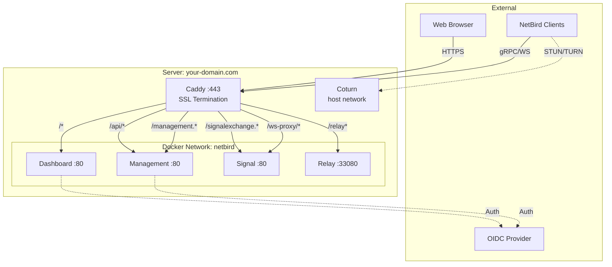
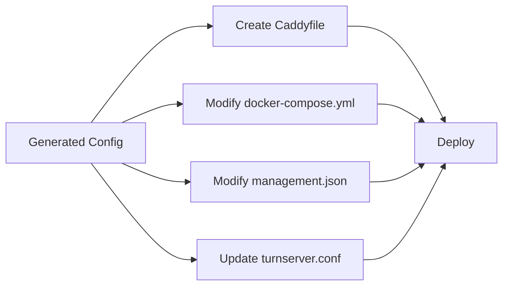

# NetBird Self-Hosted Deployment with Caddy Reverse Proxy

## Overview

This guide extends the [official NetBird Advanced Self-Hosting Guide](https://docs.netbird.io/selfhosted/selfhosted-guide) with specific modifications required for deploying NetBird behind a Caddy reverse proxy.

**Prerequisites**: You must complete Steps 1-5 of the official NetBird guide before following this document.

### Why This Guide?

The NetBird setup script (`configure.sh`) generates configurations optimized for direct service exposure with Let's Encrypt. When using Caddy as a reverse proxy, critical modifications are required:

- **Port Configuration**: Services must run on internal ports only
- **Endpoint URLs**: Must point to Caddy, not direct service ports
- **Network Architecture**: All services must join a shared Docker network
- **Protocol Handling**: Proper gRPC (h2c) and WebSocket configuration

---

## Table of Contents

1. [Prerequisites](#prerequisites)
2. [Architecture Overview](#architecture-overview)
3. [Initial Setup (NetBird Official Steps)](#initial-setup-netbird-official-steps)
4. [Caddy Integration Modifications](#caddy-integration-modifications)
5. [Configuration Templates](#configuration-templates)
6. [Deployment](#deployment)
7. [Verification](#verification)
8. [Troubleshooting](#troubleshooting)

---

## Prerequisites

### System Requirements

- Linux server (Ubuntu 20.04+ recommended)
- Docker Engine 20.10+ and Docker Compose v2
- Public IPv4 address
- Domain name with DNS configured
- 2+ CPU cores, 4GB RAM minimum


### DNS Configuration

Create an A record pointing to your server:

```
A    your-domain.com    ->    YOUR_SERVER_PUBLIC_IP
```

### OIDC Identity Provider

You must have a configured OIDC provider (Keycloak, Auth0, Azure AD, etc.) with:

- Frontend client (`netbird-client`) - public, with device authorization flow enabled
- Backend client (`netbird-backend`) - confidential, with service account enabled and realm management roles

Refer to [NetBird Identity Provider guides](https://docs.netbird.io/selfhosted/identity-providers) for detailed setup.

---

## Architecture Overview



### Key Architectural Decisions

| Aspect | Configuration | Reason |
|--------|---------------|--------|
| **Entry Point** | Caddy on :80/:443 | Single SSL termination point |
| **Backend Ports** | All services on :80 internally | Caddy handles HTTPS, backends use HTTP |
| **Network** | Shared `netbird` Docker network | Service-to-service communication |
| **Signal URL** | `your-domain.com:443` | Clients connect via Caddy, not :10000 |
| **Relay URL** | `rels://your-domain.com/relay` | Path-based routing through Caddy |
| **Coturn** | `network_mode: host` | Required for proper NAT traversal |

---

## Initial Setup (NetBird Official Steps)

**Complete Steps 1-5 from the [NetBird Advanced Guide](https://docs.netbird.io/selfhosted/selfhosted-guide) before proceeding:**

### Step 1: Get NetBird Code

```bash
cd ~
REPO="https://github.com/netbirdio/netbird/"
LATEST_TAG=$(basename $(curl -fs -o/dev/null -w %{redirect_url} ${REPO}releases/latest))
git clone --depth 1 --branch $LATEST_TAG $REPO
cd netbird/infrastructure_files/
```

### Step 2: Configure setup.env

```bash
cp setup.env.example setup.env
nano setup.env
```

**Critical settings**:

```bash
NETBIRD_DOMAIN="your-domain.com"
NETBIRD_DISABLE_LETSENCRYPT=true  # Important: Caddy will handle SSL
NETBIRD_AUTH_OIDC_CONFIGURATION_ENDPOINT="https://your-idp.com/realms/your-realm/.well-known/openid-configuration"
NETBIRD_AUTH_AUDIENCE="netbird-client"
NETBIRD_AUTH_CLIENT_ID="netbird-client"
NETBIRD_MGMT_IDP="keycloak"  # or auth0, azure, etc.
NETBIRD_IDP_MGMT_CLIENT_ID="netbird-backend"
NETBIRD_IDP_MGMT_CLIENT_SECRET="YOUR_BACKEND_SECRET"
NETBIRD_IDP_MGMT_EXTRA_ADMIN_ENDPOINT="https://your-idp.com/admin/realms/your-realm"
```

### Step 3: Configure Identity Provider

Follow the appropriate guide for your IDP from the [official documentation](https://docs.netbird.io/selfhosted/identity-providers).

### Step 4: Generate Secrets

```bash
# TURN password (save this)
openssl rand -base64 32

# Relay secret (save this)
openssl rand -base64 32

# DataStore encryption key (save this)
openssl rand -base64 32
```

### Step 5: Run Configuration Script

```bash
./configure.sh
```

This generates:

- `artifacts/docker-compose.yml` (needs modifications)
- `artifacts/management.json` (needs modifications)
- `artifacts/turnserver.conf` (mostly correct, update external-ip)

**⚠️ STOP HERE** - Do not run `docker compose up` yet. The generated files need Caddy-specific modifications.

---

## Caddy Integration Modifications

The generated configuration files expose services directly. For Caddy integration, you must modify three files and create one new file.

### Overview of Required Changes



---

## Configuration Templates

### Template 1: Caddyfile

**Create** `artifacts/Caddyfile`:

```caddyfile
{
    # ZeroSSL for certificate issuance (or remove for Let's Encrypt)
    acme_ca https://acme.zerossl.com/v2/DV90
    email your-email@example.com
}

your-domain.com {
    # Security headers
    header {
        Strict-Transport-Security max-age=31536000;
        X-Content-Type-Options nosniff
        X-Frame-Options DENY
    }

    # Management gRPC - HTTP/2 cleartext (h2c)
    reverse_proxy /management.ManagementService/* {
        to management:80
        transport http {
            versions h2c
        }
    }

    # Signal gRPC - HTTP/2 cleartext (h2c)
    reverse_proxy /signalexchange.SignalExchange/* {
        to signal:80
        transport http {
            versions h2c
        }
    }

    # Signal WebSocket
    reverse_proxy /ws-proxy/signal* {
        to signal:80
        header_up Host {host}
        header_up X-Real-IP {remote_ip}
        header_up X-Forwarded-For {remote_ip}
        header_up X-Forwarded-Proto {scheme}
        header_up Upgrade {>Upgrade}
        header_up Connection {>Connection}
    }

    # Management WebSocket
    reverse_proxy /ws-proxy/management* {
        to management:80
        header_up Host {host}
        header_up X-Real-IP {remote_ip}
        header_up X-Forwarded-For {remote_ip}
        header_up X-Forwarded-Proto {scheme}
        header_up Connection {>Connection}
        header_up Upgrade {>Upgrade}
    }

    # Relay WebSocket
    reverse_proxy /relay* {
        to relay:33080
        header_up Host {host}
        header_up X-Real-IP {remote_ip}
        header_up X-Forwarded-For {remote_ip}
        header_up X-Forwarded-Proto {scheme}
        header_up Upgrade {>Upgrade}
        header_up Connection {>Connection}
    }

    # Management REST API
    reverse_proxy /api/* {
        to management:80
        header_up Host {host}
        header_up X-Real-IP {remote_ip}
        header_up X-Forwarded-For {remote_ip}
        header_up X-Forwarded-Proto {scheme}
    }

    # Dashboard UI - catch-all (must be last)
    reverse_proxy /* {
        to dashboard:80
        header_up Host {host}
        header_up X-Real-IP {remote_ip}
        header_up X-Forwarded-For {remote_ip}
        header_up X-Forwarded-Proto {scheme}
    }
}
```

**Key Points**:

- Replace `your-domain.com` with your actual domain
- Replace `your-email@example.com` with your email
- Order matters: specific routes before catch-all
- `h2c` is HTTP/2 cleartext for gRPC

### Template 2: docker-compose.yml Modifications

**Edit** `artifacts/docker-compose.yml`:

#### A. Add Caddy Service (after `services:`)

```yaml
services:
  # ADD THIS ENTIRE BLOCK
  netbird-caddy:
    <<: *default
    image: caddy:2-alpine
    container_name: netbird-caddy
    ports:
      - "80:80"
      - "443:443"
    volumes:
      - ./Caddyfile:/etc/caddy/Caddyfile
      - caddy_data:/data
    networks:
      - netbird
    depends_on:
      - management
      - signal
```

#### B. Modify Dashboard Service

```yaml
dashboard:
  <<: *default
  image: netbirdio/dashboard:latest
  ports:
    - 8081:80                    # CHANGE: was "80:80" and "443:443"
  networks:                      # ADD
    - netbird                    # ADD
  environment:
    # CHANGE these two lines (remove :33073 ports)
    - NETBIRD_MGMT_API_ENDPOINT=https://your-domain.com
    - NETBIRD_MGMT_GRPC_API_ENDPOINT=https://your-domain.com
    # Keep all other environment variables as-is
    - AUTH_AUDIENCE=netbird-client
    - AUTH_CLIENT_ID=netbird-client
    - AUTH_AUTHORITY=https://your-idp.com/realms/your-realm
    - USE_AUTH0=false
    - AUTH_SUPPORTED_SCOPES=openid profile email offline_access api
    - NETBIRD_TOKEN_SOURCE=accessToken
    - NGINX_SSL_PORT=443
  volumes:
    - netbird-letsencrypt:/etc/letsencrypt/
```

#### C. Modify Signal Service

```yaml
signal:
  <<: *default
  image: netbirdio/signal:latest
  networks:                      # ADD
    - netbird                    # ADD
  volumes:
    - netbird-signal:/var/lib/netbird
  ports:
    - 10000:80                   # Keep as-is
```

#### D. Modify Management Service

```yaml
management:
  <<: *default
  image: netbirdio/management:latest
  depends_on:
    - dashboard
  networks:                      # ADD
    - netbird                    # ADD
  volumes:
    - netbird-mgmt:/var/lib/netbird
    - netbird-letsencrypt:/etc/letsencrypt:ro
    - ./management.json:/etc/netbird/management.json
  ports:
    - 33073:80                   # CHANGE: was "33073:443"
  command: [
    "--port", "80",              # CHANGE: was "443"
    "--log-file", "console",
    "--log-level", "info",
    "--disable-anonymous-metrics=false",
    "--single-account-mode-domain=your-domain.com",
    "--dns-domain=netbird.selfhosted"
  ]
  environment:
    - NETBIRD_STORE_ENGINE_POSTGRES_DSN=
    - NETBIRD_STORE_ENGINE_MYSQL_DSN=
```

#### E. Modify Relay Service

```yaml
relay:
  <<: *default
  image: netbirdio/relay:latest
  networks:                      # ADD
    - netbird                    # ADD
  environment:
    - NB_LOG_LEVEL=info
    - NB_LISTEN_ADDRESS=:33080
    # CHANGE: Remove port from address, use path only
    - NB_EXPOSED_ADDRESS=rels://your-domain.com/relay
    - NB_AUTH_SECRET=YOUR_RELAY_SECRET    # Use generated secret
  ports:
    - 33080:33080
```

#### F. Keep Coturn As-Is

```yaml
coturn:
  <<: *default
  image: coturn/coturn:latest
  volumes:
    - ./turnserver.conf:/etc/turnserver.conf:ro
  network_mode: host             # Important: must use host network
  command:
    - -c /etc/turnserver.conf
```

#### G. Add Networks and Volumes (at the end)

```yaml
# ADD if not present
networks:
  netbird:

volumes:
  netbird-mgmt:
  netbird-signal:
  netbird-letsencrypt:
  caddy_data:                    # ADD this volume
```

### Template 3: management.json Modifications

**Edit** `artifacts/management.json`:

#### A. Fix STUN Configuration

```json
{
  "Stuns": [
    {
      "Proto": "udp",
      "URI": "stun:your-domain.com:3478",    // ADD :3478 if missing
      "Username": "",
      "Password": ""                         // Change from null to ""
    }
  ]
}
```

#### B. Fix TURN Configuration

```json
{
  "TURNConfig": {
    "TimeBasedCredentials": false,
    "CredentialsTTL": "12h0m0s",
    "Secret": "YOUR_STRONG_SECRET",          // CHANGE: not "secret"
    "Turns": [
      {
        "Proto": "udp",
        "URI": "turn:your-domain.com:3478",  // Verify :3478 is present
        "Username": "self",
        "Password": "YOUR_TURN_PASSWORD"     // Use generated password
      }
    ]
  }
}
```

#### C. Fix Relay Configuration

```json
{
  "Relay": {
    "Addresses": [
      "rels://your-domain.com/relay"         // CHANGE: remove :33080 if present
    ],
    "CredentialsTTL": "24h0m0s",
    "Secret": "YOUR_RELAY_SECRET"            // MUST match docker-compose NB_AUTH_SECRET
  }
}
```

#### D. Fix Signal Configuration

```json
{
  "Signal": {
    "Proto": "https",
    "URI": "your-domain.com:443",            // CHANGE: was :10000
    "Username": "",
    "Password": ""                           // Change from null to ""
  }
}
```

#### E. Add DataStore Encryption Key (if missing)

```json
{
  "Datadir": "/var/lib/netbird/",
  "DataStoreEncryptionKey": "YOUR_DATASTORE_KEY",    // ADD if missing
  "StoreConfig": {
    "Engine": "sqlite"
  }
}
```

#### F. Verify HttpConfig (usually correct)

```json
{
  "HttpConfig": {
    "AuthAudience": "netbird-client",
    "AuthIssuer": "https://your-idp.com/realms/your-realm",
    "AuthKeysLocation": "https://your-idp.com/realms/your-realm/protocol/openid-connect/certs",
    "OIDCConfigEndpoint": "https://your-idp.com/realms/your-realm/.well-known/openid-configuration",
    "IdpSignKeyRefreshEnabled": false
  }
}
```

### Template 4: turnserver.conf Modification

**Edit** `artifacts/turnserver.conf`:

Find and update:

```conf
external-ip=YOUR_SERVER_PUBLIC_IP    # MUST be set to server's public IP

user=self:YOUR_TURN_PASSWORD         # MUST match management.json TURN password
```

Get your public IP:

```bash
curl -4 ifconfig.me
```

---

## Deployment

### Deploy Services

```bash
cd ~/netbird/infrastructure_files/artifacts

# Start all services
docker compose up -d

# Watch startup logs
docker compose logs -f
```

**Expected behavior**:

1. Caddy obtains SSL certificate (30-120 seconds)
2. All services start and connect
3. No critical errors in logs

### Monitor Certificate Issuance

```bash
# Watch Caddy logs
docker compose logs -f netbird-caddy

# Look for:
# "certificate obtained successfully"
```

### Verify Deployment

```bash
# Check all containers running
docker compose ps

# Expected: 6 containers running
# - netbird-caddy
# - artifacts-management-1
# - artifacts-signal-1
# - artifacts-relay-1
# - artifacts-dashboard-1
# - artifacts-coturn-1

# Test HTTPS
curl -I https://your-domain.com

# Expected: HTTP/2 200
```

---

## Verification

### 1. Dashboard Access

1- Navigate to <https://your-domain.com>
2- You will be redirected to your Identity Provider (IdP) login page
3- Authenticate on the IdP
4- After successful authentication, you are redirected back to <https://your-domain.com>
5- The NetBird dashboard UI loads with valid SSL
6- You can view peers and interact with the dashboard

**If login fails**:

```bash
docker compose logs dashboard
docker compose logs management | grep -i auth
```

### 2. STUN Server Test

```bash
# Install STUN client
sudo apt install stun-client -y

# Test STUN
stun your-domain.com -p 3478

# Expected:
# Mapped address: YOUR_PUBLIC_IP:RANDOM_PORT
```

### 3. Client Connection Test

#### Install NetBird Client

**Linux**:

```bash
curl -fsSL https://pkgs.netbird.io/install.sh | sh
```

**macOS**:

```bash
brew install netbirdio/tap/netbird
```

#### Connect First Peer

```bash
# Connect to your self-hosted instance
netbird up --management-url https://your-domain.com

# Follow device authorization link
# Complete authentication in browser

# Check status
netbird status

# Expected output:
# Management: Connected [https://your-domain.com]
# Signal: Connected
# Relays: 1/1 Available
# NetBird IP: 100.64.0.X
```

#### Connect Second Peer and Test

On another machine:

```bash
netbird up --management-url https://your-domain.com

# After authentication
netbird status
netbird peers list

# Test connectivity (use NetBird IP from first peer)
ping 100.64.0.1
```

---

## Troubleshooting

### Issue: Caddy Cannot Obtain SSL Certificate

**Symptoms**: Dashboard inaccessible, HTTPS errors

**Diagnosis**:

```bash
docker compose logs netbird-caddy | grep -i error
```

**Solutions**:

1. Verify DNS: `dig your-domain.com` (must return server IP)
2. Check ports 80/443 accessible: `nc -zv your-domain.com 80`
3. Ensure domain not proxied (CloudFlare: set to DNS-only)
4. Verify firewall: `sudo ufw status`

### Issue: Dashboard Shows "Unauthorized"

**Symptoms**: Login succeeds but dashboard shows unauthorized

**Diagnosis**:

```bash
docker compose logs management | grep -i "token validation"
```

**Solutions**:

1. Verify `AuthIssuer` matches IDP exactly
2. Test OIDC endpoint:

```bash
curl https://your-idp.com/realms/your-realm/.well-known/openid-configuration
```

3. Check system time: `timedatectl` (must be synced)

### Issue: Signal Disconnected

**Symptoms**: Client shows "Signal: Disconnected"

**Diagnosis**:

```bash
docker compose logs signal
docker compose logs management | grep -i signal
```

**Solutions**:

1. Verify Signal URI in management.json is `your-domain.com:443` (not `:10000`)
2. Check Caddyfile has signal routes
3. Restart services: `docker compose restart signal management`

### Issue: Relay Unavailable

**Symptoms**: Relay status unavailable in client

**Diagnosis**:

```bash
docker compose logs relay
grep "NB_AUTH_SECRET" artifacts/docker-compose.yml
grep "Secret" artifacts/management.json | grep -A 5 Relay
```

**Solutions**:

1. Verify secrets match:

```bash
# Compare these two values - they must be identical
docker compose exec relay env | grep NB_AUTH_SECRET
```

2. Verify relay address format: `rels://your-domain.com/relay` (no `:33080`)
3. Restart relay: `docker compose restart relay`

### Issue: TURN Server Not Working

**Symptoms**: Peers behind NAT cannot connect

**Diagnosis**:

```bash
docker compose logs coturn | tail -50
```

**Solutions**:

1. Verify external-ip in turnserver.conf:

```bash
curl -4 ifconfig.me  # Get your IP
grep external-ip artifacts/turnserver.conf
```

2. Ensure passwords match between turnserver.conf and management.json
3. Check UDP ports: `sudo ufw status | grep 3478`

### Issue: Backend Cannot Manage Users

**Symptoms**: "IDP connection failed" in logs

**Solutions**:

1. Test backend client:

```bash
curl -X POST "https://your-idp.com/realms/your-realm/protocol/openid-connect/token" \
  -d "grant_type=client_credentials" \
  -d "client_id=netbird-backend" \
  -d "client_secret=YOUR_SECRET"
```

2. Verify service account has realm-admin role in IDP

### Common Configuration Mistakes

| Symptom | Likely Cause | Fix |
|---------|--------------|-----|
| SSL certificate fails | DNS not pointing to server | Update A record |
| Dashboard 401 errors | Token validation failing | Check AuthIssuer matches IDP |
| Signal won't connect | Wrong port in Signal URI | Use `:443` not `:10000` |
| Relay unavailable | Secret mismatch | Match secrets in docker-compose & management.json |
| Relay unavailable | Port in relay address | Use `/relay` not `:33080/relay` |
| Management won't start | Port conflict | Change to `33073:80` and `--port 80` |
| Clients can't ping | TURN not working | Set external-ip in turnserver.conf |

### Enable Debug Logging

```bash
# Edit docker-compose.yml
# Change log levels:

management:
  command: [
    "--log-level", "debug",    # was "info"
    ...
  ]

relay:
  environment:
    - NB_LOG_LEVEL=debug       # was "info"

# Restart
docker compose up -d
docker compose logs -f
```

## Additional Resources

- **NetBird Documentation**: <https://docs.netbird.io/>
- **NetBird GitHub**: <https://github.com/netbirdio/netbird>
- **Caddy Documentation**: <https://caddyserver.com/docs/>
- **Identity Provider Guides**: <https://docs.netbird.io/selfhosted/identity-providers>