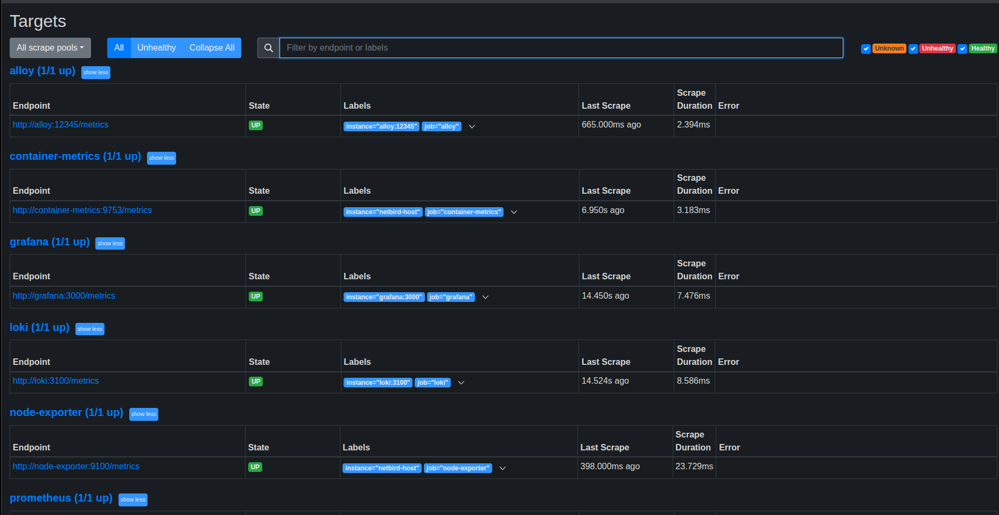

# Observability Stack with Docker Compose

This document describes how to spin up a **test NetBird deployment** and attach the **`monitor-netbird` observability stack** to it.

The goal is to give you a production-style setup where you can:

- Run a self-hosted NetBird control plane backed by Zitadel.
- Collect **logs** from the host and all NetBird-related containers.
- Collect **metrics** from the host and containers.
- Explore everything in **Grafana** using **Prometheus** and **Loki** as data sources.

The instructions below assume you are in the root of this repository.

---

## Prerequisites

- A Linux host with Docker and Docker Compose v2 installed.
- Permission to run `docker compose`.
- The NetBird stack started from this repository. Ensure the Docker Compose project name is consistent if you've customized it, as the monitoring stack relies on these names for network and volume connectivity.

If you deliberately run NetBird with a different project name, update the external network and volume names in `monitor-netbird/docker-compose.yaml` accordingly before starting the monitoring stack. Refer to the [Docker Compose documentation](https://docs.docker.com/reference/compose-file/networks/) for more details on network configuration.

---

## 1. Bootstrapping a test NetBird deployment

If you already have a NetBird management stack running, you can **skip this section** and go directly to [Deploying the monitoring stack](#3-deploying-the-monitoring-stack).

For a fresh test environment, we provide `getting-started-with-zatadel.sh`, which launches a NetBird control plane backed by Zitadel and Postgres.

### 1.1 Configure environment variables

Before running the script, set the following environment variables in your shell:

```bash
export NETBIRD_DISABLE_LETSENCRYPT=true
export NETBIRD_DOMAIN="<YOUR_NETBIRD_DOMAIN_OR_IP>" # Replace with your host IP or domain
```

Notes:

- `NETBIRD_DISABLE_LETSENCRYPT=true` keeps the setup simple and avoids automatic certificate management. This is appropriate for a local / lab deployment.
- `NETBIRD_DOMAIN` is the host you will use to reach the NetBird dashboard. For a test environment this is often a **plain IP address** (e.g. `192.0.2.10`). In production, you should use a proper DNS name with TLS.

### 1.2 Running the script

From the repository root:

```bash
./getting-started-with-zatadel.sh
```

The script will:

- Bring up Zitadel, Postgres, and the NetBird services (management, dashboard, signal, relay, etc.).
- Configure them to listen on the host specified in `NETBIRD_DOMAIN`.

### 1.3 Browser configuration for insecure origins (testing only)

If you are using **HTTP over an IP address or an otherwise insecure origin**, modern browsers will treat the origin as insecure and some login flows may fail with messages like **"Error: Unauthenticated"**.

For a *test-only* environment you can relax this behavior in your browser. For example, in **Brave**:

1. Open your browser's flags page (e.g., `chrome://flags` for Chrome-based browsers).
2. Search for "Insecure origins treated as secure" or similar.
3. Enable the flag and add your dashboard URL to the list, for example:
   - `http://<YOUR_NETBIRD_DOMAIN_OR_IP>`

Use this only in non-production environments. For production, you should configure proper TLS certificates and avoid weakening browser security.

### 1.4 Verifying the NetBird stack

After the script completes, verify that all NetBird services are up and healthy:

```bash
# From the NetBird project root (same directory where you ran the script)
docker compose ps
```

You should see containers similar to (names may differ based on your compose project name):

```text
<project>-caddy-1        caddy                        ...   Up (healthy)
<project>-coturn-1       coturn/coturn                ...   Up
<project>-dashboard-1    netbirdio/dashboard:latest   ...   Up
<project>-management-1   netbirdio/management:latest  ...   Up
<project>-relay-1        netbirdio/relay:latest       ...   Up
<project>-signal-1       netbirdio/signal:latest      ...   Up
<project>-zdb-1          postgres:16-alpine           ...   Up (healthy)
<project>-zitadel-1      ghcr.io/zitadel/zitadel:...  ...   Up
```

The example below shows a healthy test deployment:


If any container is restarting or unhealthy, fix that before deploying the monitoring stack.

---

## 2. What the `monitor-netbird` stack provides

The `monitor-netbird/` directory contains a self-contained observability stack built around **Prometheus**, **Loki**, **Grafana**, and **Grafana Alloy**.

At a high level:

- **Prometheus** stores **metrics**.
- **Loki** stores **logs**.
- **Grafana** visualizes metrics and logs.
- **Grafana Alloy** collects logs from the host and Docker containers and ships them to Loki.
- **node-exporter** exposes host and basic cgroup metrics.
- **container-metrics** (a cgroups exporter) exposes per-container resource usage.
- **netbird-events-exporter** (Rust service) tails the NetBird management `events.db` file and pushes structured activity events into Loki.

This stack is designed so that **all scrapes and pushes use internal service names**, not public IPs or domains. This keeps configuration stable across environments.

---

## 3. Deploying the monitoring stack

Once your NetBird control plane is up:

1. Change into the monitoring directory:

   ```bash
   cd monitor-netbird
   ```

2. Build the NetBird events exporter image (required on first run or after
   changing the exporter code):

   ```bash
   docker compose build netbird-events-exporter
   ```

3. Start the monitoring services:

   ```bash
   docker compose up -d
   ```

This brings up the following services:

- `loki` 
- `prometheus`
- `grafana`
- `alloy`
- `node-exporter`
- `container-metrics`
- `netbird-events-exporter`

Use `docker compose ps` from within `monitor-netbird/` to confirm they are all `Up` and, where applicable, `healthy`.

A typical healthy monitoring stack looks like this:


---

## 4. Accessing Grafana and adding data sources

By default, Grafana listens on port **3000** on the host where Docker is running.

Open your browser and go to:

```text
http://<YOUR_HOST_IP_OR_DOMAIN>:3000/
```

Replace `<HOST_IP_OR_DOMAIN>` with the same host you used for `NETBIRD_DOMAIN` when starting NetBird. If you are using HTTP and an IP address, the same browser considerations about insecure origins apply here as for the NetBird dashboard.

### 4.1 Login

Grafana runs with its default admin credentials (`admin`/`admin`) unless you have overridden them via environment variables. **Change the admin password immediately after first login**, especially in any environment accessible to others. Refer to the [Grafana Security documentation](https://grafana.com/docs/grafana/latest/setup-grafana/configure-security/) for best practices.

### 4.2 Configure Prometheus data source

In Grafana:

1. From **HOME** Go to **Connections** → **Data sources** → **Add data source**.
2. Choose **Prometheus**.
3. Set the URL to:

   ```text
   http://prometheus:9090
   ```

4. Leave **Access** as `Server` (Grafana will connect from inside the Docker network).
5. Click **Save & test**.

> Important: use the **service name** (`prometheus`) rather than the host IP or external domain. Inside Docker, Grafana communicates over the `monitoring` network, where services are reachable by their container names.

Example Prometheus data source configuration:


### 4.3 Configure Loki data source

1. From **HOME** Go to **Connections** → **Data sources** → **Add data source**.
2. Choose **Loki**.
3. Set the URL to:

   ```text
   http://loki:3100
   ```

4. Leave **Access** as `Server`.
5. Click **Save & test**.

Again, note that we use the **internal service name** `loki`, not the external IP.

Example Loki data source configuration:


---

## 5. What gets scraped and collected

### 5.1 Accessing the Prometheus UI

Prometheus exposes its built-in web UI on port **9090** of the host where Docker is running.

Open your browser and go to:

```text
http://<YOUR_HOST_IP_OR_DOMAIN>:9090/
```

Replace `<YOUR_HOST_IP_OR_DOMAIN>` with the same host/IP you used for the rest of the stack.
From there you can:

* View **Status → Targets** to confirm all metric endpoints are `UP`.
* Explore time-series data with **Graph** or **PromQL** queries.
* Inspect service metadata and scrape configurations.

Just like Grafana, Prometheus is intended for internal access only. Set up proper network controls and TLS if exposing it beyond a local or lab environment.

With this setup:

- **Host metrics**
  - From `node-exporter`.
  - Scraped by Prometheus at `http://node-exporter:9100`.
  - All series are labeled `job="node-exporter"` and `instance="netbird-host"`.

- **Container metrics**
  - From `container-metrics` (cgroup exporter).
  - Scraped by Prometheus at `http://container-metrics:9753`.
  - Series are labeled `job="container-metrics"` and `instance="netbird-host"`.

- **Service metrics**
  - Loki, Grafana, and Alloy expose their own `/metrics` endpoints and are scraped by Prometheus under the jobs `loki`, `grafana`, and `alloy`.

The Prometheus *Targets* page should show all of these scrape jobs in the `UP`
state, similar to the example below:



- **Container logs**
  - Alloy tails Docker logs via the Docker socket and attaches a small set of labels: `container`, `service`, `compose_project`, `host`.
  - Logs are pushed to Loki with additional external labels `cluster` and `env`.

- **System logs**
  - Alloy reads from the systemd journal and pushes to Loki with `job="systemd-journal"`.

- **NetBird activity events**
  - The Rust `netbird-events-exporter` connects to the NetBird management `events.db` (mounted read-only from the `netbird_netbird_management` volume created by the main NetBird compose stack).
  - New rows from the `events` table are periodically read and converted into structured JSON logs and pushed to Loki.

This separation ensures that **host metrics**, **container metrics**, and **logs** are easy to query without clashing labels or duplicate series.

---

## 6. Example queries and dashboards

Here are a few starting points once Grafana is wired up.

### 6.1 Host memory usage gauge

Prometheus query:

```promql
(1 - node_memory_MemAvailable_bytes / node_memory_MemTotal_bytes) * 100
```

- Use a **Gauge** panel.
- No grouping is required in this single-host setup, but you can explicitly aggregate with:

  ```promql
  avg by(instance) (
    (1 - node_memory_MemAvailable_bytes / node_memory_MemTotal_bytes) * 100
  )
  ```

You should see exactly one series for `instance="netbird-host"`.

### 6.2 Container CPU or memory usage

Look for metrics exposed by the cgroup exporter (for example, metrics prefixed with `cgroups_` or similar; exact names depend on the exporter version). You can then build panels that group by any container-related label provided by the exporter.

### 6.3 NetBird events in Loki

In Grafana Explore with the Loki data source:

- Filter NetBird management events:

  ```logql
  {job="netbird-events"}
  ```

- Further filter by activity or account:

  ```logql
  {job="netbird-events", activity="peer_added_by_user"}
  ```

Each log line contains a JSON payload describing the event (IDs, activity code, timestamp, metadata, etc.).

Example of NetBird events visible in Grafana Explore:


### 6.4 Using Loki queries in dashboards

Explore automatically chooses the right view for each Loki query. Dashboard
panels do not, so you must match the panel type to the query:

- **Raw log queries** such as:

  ```logql
  {job="netbird-events"}
  ```

  should use a **Logs** visualization.

- **Metrics-style queries** using functions, for example:

  ```logql
  rate({service="netbird-events-exporter"}[5m])
  ```

  or

  ```logql
  count_over_time({job="netbird-events"}[5m])
  ```

  should use a **Time series**, **Stat**, **Gauge**, or similar numeric panel.

The screenshot below shows `rate({service="netbird-events-exporter"}[5m])` in
Grafana Explore using the **Graph** view:

![Grafana Explore graph for `rate({service="netbird-events-exporter"}[5m])`](img/grafana-explore-netbird-events-rate.png)

If the panel type and query do not match, Grafana may show errors such as
"Data is missing a number field" or "Data is missing a string field" even
though the query works in Explore.

---

## 7. Production considerations

This repository provides a baseline for **test and lab deployments**, but the components and patterns are production-grade. For production use, you should additionally consider:

- Using real DNS names instead of raw IPs for all services.
- Enabling TLS (for NetBird, Grafana, Prometheus, Loki) and disabling any insecure-origin browser flags.
- Changing all default credentials and integrating with your organization's identity provider.
- Enabling robust retention policies and implementing regular backup strategies for Prometheus and Loki data.
- Restricting access to the Docker socket that Grafana Alloy uses for log collection to enhance security.
- Implementing network policies to control traffic flow between services.
- Regularly updating all components to their latest stable versions.

---

The `monitor-netbird` stack is intended to be a clean, understandable baseline you can confidently adapt to your own infrastructure. For Kubernetes deployments, refer to [Monitoring-NetBird-Observability-Kubernetes.md](Monitoring-NetBird-Observability-Kubernetes.md).