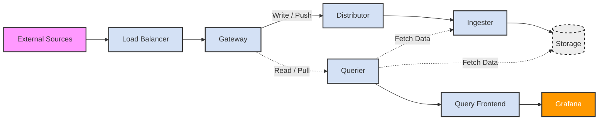
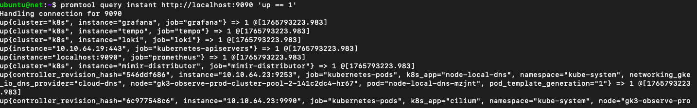
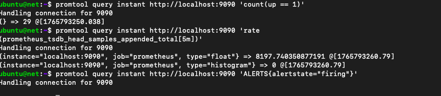

# Grafana Observability Stack Testing Documentation

## Project: <PROJECT_ID> - GKE Deployment

## Table of Contents

1. [Overview](#overview)
2. [Architecture](#architecture)
3. [Prerequisites](#prerequisites)
4. [Pre-Testing Health Checks](#pre-testing-health-checks)
5. [Component Testing](#component-testing)
6. [Remote Testing](#remote-testing)


---
<a id="overview"></a>

## 1. Overview

### 1.1 Purpose
This documentation provides comprehensive testing procedures for the Grafana observability stack deployed on GKE cluster `<PROJECT_ID>`. The testing ensures all components are functioning correctly.

### 1.2 Stack Components
- **Grafana**: Dashboard and visualization
- **Loki**: Log aggregation and storage
- **Mimir**: Long-term metrics storage (Prometheus-compatible)
- **Tempo**: Distributed tracing backend
- **Prometheus**: Metrics collection and scraping
- **Alloy**: Unified telemetry collector

---

<a id="architecture"></a>

## 2. Architecture 

### 2.1 Component Flow Diagram



### 2.2 Service Endpoints

| Component | Internal Service | Port | Type |
|-----------|-----------------|------|------|
| Grafana | monitoring-stack-grafana | 80 | ClusterIP |
| Loki Gateway | monitoring-stack-loki-gateway | 80 | ClusterIP |
| Mimir NGINX | monitoring-stack-mimir-nginx | 80 | ClusterIP |
| Tempo Gateway | monitoring-stack-tempo-gateway | 80 | ClusterIP |
| Prometheus | monitoring-stack-prometheus-server | 80 | ClusterIP |

---

<a id="prerequisites"></a>

## 3. Prerequisites 

### 3.1 Required Tools Installation

#### 3.1.0 Detect Your OS

```bash
# Detect OS
if [[ "$OSTYPE" == "linux-gnu"* ]]; then
  OS="linux"
  if grep -qi ubuntu /etc/os-release; then
    DISTRO="ubuntu"
  elif grep -qi debian /etc/os-release; then
    DISTRO="debian"
  elif grep -qi centos /etc/os-release; then
    DISTRO="centos"
  fi
elif [[ "$OSTYPE" == "darwin"* ]]; then
  OS="macos"
fi

echo "Detected OS: $OS, Distro: $DISTRO"
```

#### 3.1.1 Install Base Utilities

**Ubuntu/Debian:**
```bash
sudo apt-get update
sudo apt-get install -y curl wget unzip gnupg
```

**CentOS/RHEL:**
```bash
sudo yum install -y curl wget unzip gnupg
```

**macOS:**
```bash
brew install curl wget unzip gnupg
```

#### 3.1.2 Kubectl (Kubernetes CLI)

**Linux (amd64/arm64):**
```bash
# Detect architecture
ARCH=$(uname -m | sed 's/x86_64/amd64/' | sed 's/aarch64/arm64/')

curl -LO "https://dl.k8s.io/release/$(curl -L -s https://dl.k8s.io/release/stable.txt)/bin/linux/${ARCH}/kubectl"
chmod +x kubectl 
sudo mv kubectl /usr/local/bin/
kubectl version --client
```

**macOS:**
```bash
# Intel/Apple Silicon detection
ARCH=$(uname -m | sed 's/x86_64/amd64/' | sed 's/arm64/arm64/')

curl -LO "https://dl.k8s.io/release/$(curl -L -s https://dl.k8s.io/release/stable.txt)/bin/darwin/${ARCH}/kubectl"
chmod +x kubectl 
sudo mv kubectl /usr/local/bin/
kubectl version --client
```

**or via Package Manager:**
```bash
# Ubuntu/Debian
sudo apt-get install -y kubectl

# macOS
brew install kubectl

# CentOS
sudo yum install -y kubectl
```

#### 3.1.3 Helm (Package Manager)

**All Platforms (Universal Script):**
```bash
curl https://raw.githubusercontent.com/helm/helm/main/scripts/get-helm-3 | bash
```

**or via Package Manager:**
```bash
# Ubuntu/Debian
sudo apt-get install -y helm

# macOS
brew install helm

# CentOS
sudo yum install -y helm
```

#### 3.1.4 JQ (JSON Processor)

**Ubuntu/Debian:**
```bash
sudo apt-get install -y jq
```

**macOS:**
```bash
brew install jq
```

**CentOS/RHEL:**
```bash
sudo yum install -y jq
```

#### 3.1.5 k6 (Load Testing)

**Ubuntu/Debian:**
```bash
sudo gpg --no-default-keyring --keyring /usr/share/keyrings/k6-archive-keyring.gpg \
  --keyserver hkp://keyserver.ubuntu.com:80 \
  --recv-keys C5AD17C747E3415A3642D57D77C6C491D6AC1D69

echo "deb [signed-by=/usr/share/keyrings/k6-archive-keyring.gpg] https://dl.k6.io/deb stable main" | \
  sudo tee /etc/apt/sources.list.d/k6.list

sudo apt-get update && sudo apt-get install -y k6
```

**macOS:**
```bash
brew install k6
```

**CentOS/RHEL:**
```bash
sudo yum install -y https://dl.k6.io/rpm/repo.rpm
sudo yum install -y k6
```

#### 3.1.6 LogCLI (Loki CLI)

**Universal (All Platforms):**
```bash
# Detect OS and Architecture
OS=$(uname -s | tr '[:upper:]' '[:lower:]')
ARCH=$(uname -m | sed 's/x86_64/amd64/' | sed 's/aarch64/arm64/')

# Clean up old versions
rm -f logcli-${OS}-${ARCH}.zip logcli-${OS}-${ARCH}

# Download v3.0.0
curl -O -L "https://github.com/grafana/loki/releases/download/v3.0.0/logcli-${OS}-${ARCH}.zip"

# Unzip and Install
unzip logcli-${OS}-${ARCH}.zip
sudo mv -f logcli-${OS}-${ARCH} /usr/local/bin/logcli
sudo chmod +x /usr/local/bin/logcli

# Clean up
rm logcli-${OS}-${ARCH}.zip

# Verify
logcli --version
```

#### 3.1.7 Promtool (Prometheus CLI)

**Universal (All Platforms):**
```bash
# Detect OS and Architecture
OS=$(uname -s | tr '[:upper:]' '[:lower:]')
ARCH=$(uname -m | sed 's/x86_64/amd64/' | sed 's/aarch64/arm64/')

# Download and extract
wget https://github.com/prometheus/prometheus/releases/download/v2.45.0/prometheus-2.45.0.${OS}-${ARCH}.tar.gz
tar -xzf prometheus-2.45.0.${OS}-${ARCH}.tar.gz

# Install binary
sudo cp prometheus-2.45.0.${OS}-${ARCH}/promtool /usr/local/bin/

# Cleanup
rm -rf prometheus-2.45.0.${OS}-${ARCH} prometheus-2.45.0.${OS}-${ARCH}.tar.gz
promtool --version
```

#### 3.1.8 Grafana Alloy (Collector)

**Ubuntu/Debian:**
```bash
sudo mkdir -p /etc/apt/keyrings/
wget -q -O - https://apt.grafana.com/gpg.key | gpg --dearmor | sudo tee /etc/apt/keyrings/grafana.gpg > /dev/null

echo "deb [signed-by=/etc/apt/keyrings/grafana.gpg] https://apt.grafana.com stable main" | sudo tee /etc/apt/sources.list.d/grafana.list

sudo apt-get update
sudo apt-get install -y alloy
sudo systemctl enable alloy
sudo systemctl start alloy
sudo systemctl status alloy
```

**macOS:**
```bash
brew tap grafana/grafana
brew install grafana-alloy

# Start service (requires Homebrew Services)
brew services start grafana-alloy
brew services info grafana-alloy
```

**CentOS/RHEL:**
```bash
sudo yum install -y https://rpm.grafana.com/grafana-alloy-latest.x86_64.rpm
sudo systemctl enable alloy
sudo systemctl start alloy
sudo systemctl status alloy
```

**Docker (Any OS):**
```bash
docker run -d \
  --name alloy \
  --restart always \
  -p 12345:12345 \
  -v /path/to/config.alloy:/etc/alloy/config.alloy \
  grafana/alloy:latest run --server.http.listen-
```

### 3.2 GKE Cluster Access

```bash
# Authenticate with GCP
gcloud auth login

# Set project
gcloud config set project <PROJECT_ID>

# Get cluster credentials
gcloud container clusters get-credentials <cluster-name> \
  --zone=<zone> \
  --project=<PROJECT_ID>

# Verify access
kubectl get nodes
kubectl get namespaces
kubectl get pods -n <NAMESPACE>
```

### 3.3 Access Credentials

```bash
# Get Grafana admin password
export GRAFANA_PASSWORD=$(kubectl get secret -n <NAMESPACE> \
  monitoring-stack-grafana -o jsonpath="{.data.admin-password}" | base64 --decode)
echo "Grafana Password: $GRAFANA_PASSWORD"

# Store for later use
echo "export GRAFANA_PASSWORD='$GRAFANA_PASSWORD'" >> ~/.bashrc
source ~/.bashrc
```

---

<a id="pre-testing-health-checks"></a>

## 4. Pre-Testing Health Checks

### 4.1 Comprehensive Health Check

```bash
# Check all pod statuses
kubectl get pods -n <NAMESPACE> -o wide

# Identify any unhealthy pods
kubectl get pods -n <NAMESPACE> --field-selector=status.phase!=Running

# Check pod events
kubectl get events -n <NAMESPACE> --sort-by='.lastTimestamp' | tail -20

# Verify all services have endpoints
kubectl get endpoints -n <NAMESPACE>

# Check resource usage
kubectl top nodes
kubectl top pods -n <NAMESPACE> --sort-by=memory
```

### 4.2 Service Connectivity Test

```bash
# To view services
kubectl get svc -n <NAMESPACE> 
# Test internal DNS resolution
kubectl run -n <NAMESPACE>  dns-test --image=busybox:1.28 \
  --rm -it --restart=Never -- \
  nslookup <SERVICE_NAME>

# Test all major endpoints
## 1. Test Loki Gateway (Needs /loki prefix usually)
kubectl run -n <NAMESPACE> test-loki --image=curlimages/curl -it --rm --restart=Never -- \
  curl -v --max-time 5 "http://<LOKI_GATAWAY_SERVICE_NAME>/loki/ready"

## 2. Test Mimir Gateway (Mimics Prometheus API)
kubectl run -n <NAMESPACE> test-mimir --image=curlimages/curl -it --rm --restart=Never -- \
  curl -v --max-time 5 "http://<MIMIR_GATAWAY_SERVICE_NAME>/api/v1/status/buildinfo"

## 3. Test Tempo Gateway (Often requires /status or is restricted)
kubectl run -n <NAMESPACE> test-tempo --image=curlimages/curl -it --rm --restart=Never -- \
  curl -v --max-time 5 "http://<TEMPO_GATAWAY_SERVICE_NAME>/ready"
```

### 4.4 Storage Health

```bash
# Check PVC status
kubectl get pvc -n <NAMESPACE>

# Verify all are Bound
kubectl get pvc -n <NAMESPACE> -o wide | grep -v Bound || echo "All PVCs are Bound"
# Check disk usage on ingesters
kubectl exec -n observablitiy <PVC_NAME> -- df -h

```

<a id="component-testing"></a>

## 5. Component Testing(still on cluster) 

### 5.1 Loki Testing (Log Aggregation)

#### 5.1.1 Create Test Namespace

```bash
# Create namespace for test applications
kubectl create namespace test-apps

# Label for monitoring
kubectl label namespace test-apps monitoring=enabled
```

#### 5.1.2 Deploy Multi-Level Log Generator

Create file `log-generator.yaml`:

```yaml
apiVersion: apps/v1
kind: Deployment
metadata:
  name: log-generator
  namespace: test-apps
  labels:
    app: log-generator
spec:
  replicas: 3
  selector:
    matchLabels:
      app: log-generator
  template:
    metadata:
      labels:
        app: log-generator
    spec:
      containers:
      - name: json-logs
        image: mingrammer/flog:0.4.3
        args:
          - --loop
          - --format=json
          - --number=10
          - --delay=1s
        resources:
          requests:
            memory: "64Mi"
            cpu: "100m"
          limits:
            memory: "128Mi"
            cpu: "200m"
      - name: structured-logs
        image: busybox:1.28
        command: ["/bin/sh"]
        args:
          - -c
          - |
            while true; do
              echo "$(date -u +%Y-%m-%dT%H:%M:%SZ) level=info msg=\"Application started\" service=api version=1.0.0"
              sleep 2
              echo "$(date -u +%Y-%m-%dT%H:%M:%SZ) level=warn msg=\"High memory usage\" memory_percent=85 threshold=80"
              sleep 3
              echo "$(date -u +%Y-%m-%dT%H:%M:%SZ) level=error msg=\"Database connection failed\" error=\"timeout after 30s\" retry_count=3"
              sleep 2
              echo "$(date -u +%Y-%m-%dT%H:%M:%SZ) level=debug msg=\"Cache hit\" key=user:12345 hit_rate=92.5"
              sleep 3
            done
        resources:
          requests:
            memory: "32Mi"
            cpu: "50m"
---
apiVersion: apps/v1
kind: Deployment
metadata:
  name: error-simulator
  namespace: test-apps
spec:
  replicas: 2
  selector:
    matchLabels:
      app: error-simulator
  template:
    metadata:
      labels:
        app: error-simulator
    spec:
      containers:
      - name: error-generator
        image: busybox:1.28
        command: ["/bin/sh"]
        args:
          - -c
          - |
            while true; do
              # Simulate various error scenarios
              echo "ERROR: Out of memory exception in thread main"
              sleep 5
              echo "FATAL: Unable to connect to database: connection refused"
              sleep 7
              echo "ERROR: HTTP 500 Internal Server Error on /api/users"
              sleep 4
              echo "CRITICAL: Disk usage exceeded 95% on /data"
              sleep 6
            done
```

Deploy and verify:

```bash
# Deploy log generators
kubectl apply -f log-generator.yaml

# Wait for pods to be ready
kubectl wait --for=condition=ready pod -l app=log-generator \
  -n test-apps --timeout=120s

# Verify logs are being generated
kubectl logs -n test-apps -l app=log-generator -c json-logs --tail=10
kubectl logs -n test-apps -l app=log-generator -c structured-logs --tail=10
kubectl logs -n test-apps -l app=error-simulator --tail=10
```

#### 5.1.3 Test Loki Ingestion

```bash
# Port-forward to Loki gateway
kubectl port-forward -n <NAMESPACE> svc/monitoring-stack-loki-gateway 3100:80 &
PF_PID=$!

# Wait for port-forward to establish
sleep 3

# Set Loki address for logcli
export LOKI_ADDR=http://localhost:3100

# Query all logs from test-apps
logcli query '{namespace="test-apps"}' --limit=50 --since=5m

# Query error logs only
logcli query '{namespace="test-apps"} |~ "(?i)error|fatal|critical"' \
  --limit=20 --since=5m

# Query with label filtering
logcli query '{namespace="test-apps",app="error-simulator"}' \
  --limit=10 --since=5m

# Query with JSON parsing
logcli query '{namespace="test-apps",container="json-logs"} | json' \
  --limit=10 --since=5m
# Test label values endpoint
curl -G -s "http://localhost:3100/loki/api/v1/label/namespace/values" | jq

# Verify ingestion rate
curl -s "http://localhost:3100/metrics" | grep loki_distributor_lines_received_total

# Kill port-forward when done
kill $PF_PID
```

The output is as follows:


#### 5.1.4 Verify Loki Components

```bash
# Check distributor is receiving logs
kubectl logs -n <NAMESPACE> -l app.kubernetes.io/component=distributor \
  --tail=50 | grep -i "pushed"

# Check ingester is flushing chunks
kubectl logs -n <NAMESPACE> monitoring-stack-loki-ingester-zone-a-0 \
  --tail=50 | grep -i "flushed"

# Check querier is serving queries
kubectl logs -n <NAMESPACE> -l app.kubernetes.io/component=querier \
  --tail=50 | grep -i "query"

# Verify canaries are working
kubectl logs -n <NAMESPACE> -l app.kubernetes.io/component=canary \
  --tail=20
```

### 5.2 Mimir Testing (Metrics Storage)

#### 5.2.1 Deploy Metrics Generator

Create file `metrics-generator.yaml`:

```yaml
apiVersion: apps/v1
kind: Deployment
metadata:
  name: metrics-generator
  namespace: test-apps
  labels:
    app: metrics-generator
spec:
  replicas: 3
  selector:
    matchLabels:
      app: metrics-generator
  template:
    metadata:
      labels:
        app: metrics-generator
      annotations:
        prometheus.io/scrape: "true"
        prometheus.io/port: "8080"
        prometheus.io/path: "/metrics"
    spec:
      containers:
      - name: prometheus-example-app
        image: quay.io/brancz/prometheus-example-app:v0.3.0
        ports:
        - containerPort: 8080
          name: metrics
        resources:
          requests:
            memory: "64Mi"
            cpu: "100m"
          limits:
            memory: "128Mi"
            cpu: "200m"
        livenessProbe:
          httpGet:
            path: /
            port: 8080
          initialDelaySeconds: 5
          periodSeconds: 10
---
apiVersion: v1
kind: Service
metadata:
  name: metrics-generator
  namespace: test-apps
  labels:
    app: metrics-generator
spec:
  selector:
    app: metrics-generator
  ports:
  - port: 8080
    targetPort: 8080
    name: metrics
---
apiVersion: monitoring.coreos.com/v1
kind: ServiceMonitor
metadata:
  name: metrics-generator-monitor
  namespace: test-apps
  labels:
    app: metrics-generator
    release: monitoring-stack
spec:
  selector:
    matchLabels:
      app: metrics-generator
  endpoints:
  - port: metrics
    interval: 30s
    path: /metrics
```

Deploy and generate traffic:

```bash
# Deploy metrics generator
kubectl apply -f metrics-generator.yaml

# Wait for pods
kubectl wait --for=condition=ready pod -l app=metrics-generator \
  -n test-apps --timeout=120s

# Verify metrics endpoint
kubectl port-forward -n test-apps svc/metrics-generator 8080:8080 &
sleep 2
curl http://localhost:8080/metrics | head -20
pkill -f "port-forward.*8080"

# Generate traffic to create metrics
kubectl run -n test-apps load-generator --image=curlimages/curl \
  --restart=Never -- /bin/sh -c \
  "while true; do curl -s http://metrics-generator:8080 > /dev/null; sleep 0.5; done" &

# Monitor the load
watch -n 2 'kubectl top pods -n test-apps -l app=metrics-generator'
```

#### 5.2.2 Test Mimir Ingestion

```bash
# Port-forward to Mimir
kubectl port-forward -n <NAMESPACE> svc/monitoring-stack-mimir-nginx 8080:80 &
sleep 3

# Query Mimir for test-apps metrics
curl -G http://localhost:8080/prometheus/api/v1/query \
  --data-urlencode 'query=up{namespace="test-apps"}' | jq

# Query HTTP request rate
curl -G http://localhost:8080/prometheus/api/v1/query \
  --data-urlencode 'query=rate(http_requests_total{namespace="test-apps"}[5m])' | jq

# Count active series
curl -G http://localhost:8080/prometheus/api/v1/query \
  --data-urlencode 'query=count(up{namespace="test-apps"})' | \
  jq '.data.result[0].value[1]'

# List all metrics from test app
curl -G http://localhost:8080/prometheus/api/v1/label/__name__/values | \
  jq '.data[]' | grep -i example

# Query range data
curl -G http://localhost:8080/prometheus/api/v1/query_range \
  --data-urlencode 'query=rate(http_requests_total{namespace="test-apps"}[1m])' \
  --data-urlencode 'start='$(date -d '10 minutes ago' +%s) \
  --data-urlencode 'end='$(date +%s) \
  --data-urlencode 'step=60' | jq '.data.result[0].values | length'

pkill -f "port-forward.*8080"
```

#### 5.2.3 Verify Mimir Components

```bash
# Check distributor metrics
kubectl logs -n <NAMESPACE> \
  -l app.kubernetes.io/component=distributor,app.kubernetes.io/name=mimir \
  --tail=50 | grep -i "sample"

# Check ingester status
kubectl logs -n <NAMESPACE> monitoring-stack-mimir-ingester-0 \
  --tail=50 | grep -i "series"

# Check querier logs
kubectl logs -n <NAMESPACE> \
  -l app.kubernetes.io/component=querier,app.kubernetes.io/name=mimir \
  --tail=50

# Verify compactor is working
kubectl logs -n <NAMESPACE> monitoring-stack-mimir-compactor-0 \
  --tail=50 | grep -i "compact"
```

### 5.3 Tempo Testing (Distributed Tracing)

#### 5.3.1 Deploy Trace Generator

Create file `trace-generator.yaml`:

```yaml
apiVersion: apps/v1
kind: Deployment
metadata:
  name: trace-generator
  namespace: test-apps
  labels:
    app: trace-generator
spec:
  replicas: 2
  selector:
    matchLabels:
      app: trace-generator
  template:
    metadata:
      labels:
        app: trace-generator
    spec:
      containers:
      - name: synthetic-load
        image: omnition/synthetic-load-generator:1.0.25
        env:
        - name: JAEGER_COLLECTOR_URL
          value: "http://monitoring-stack-tempo-distributor.<NAMESPACE>.svc.cluster.local:14268/api/traces"
        - name: JAEGER_SERVICE_NAME
          value: "synthetic-load-test"
        - name: JAEGER_SAMPLER_TYPE
          value: "const"
        - name: JAEGER_SAMPLER_PARAM
          value: "1"
        resources:
          requests:
            memory: "128Mi"
            cpu: "100m"
          limits:
            memory: "256Mi"
            cpu: "200m"
---
apiVersion: apps/v1
kind: Deployment
metadata:
  name: microservice-simulator
  namespace: test-apps
spec:
  replicas: 2
  selector:
    matchLabels:
      app: microservice-sim
  template:
    metadata:
      labels:
        app: microservice-sim
    spec:
      containers:
      - name: frontend
        image: grafana/xk6-client-tracing:v0.0.2
        env:
        - name: ENDPOINT
          value: "monitoring-stack-tempo-distributor.<NAMESPACE>.svc.cluster.local:4317"
        - name: SERVICE_NAME
          value: "frontend-service"
        - name: OTEL_EXPORTER_OTLP_INSECURE
          value: "true"
        resources:
          requests:
            memory: "64Mi"
            cpu: "50m"
```

Deploy and verify:

```bash
# Deploy trace generators
kubectl apply -f trace-generator.yaml

# Wait for pods
kubectl wait --for=condition=ready pod -l app=trace-generator \
  -n test-apps --timeout=120s

# Check if traces are being generated
kubectl logs -n test-apps -l app=trace-generator --tail=50
```

#### 5.3.2 Test Tempo Ingestion

```bash
# Port-forward to Tempo gateway
kubectl port-forward -n <NAMESPACE> svc/monitoring-stack-tempo-gateway 3200:80 &
sleep 3

# Search for traces
curl -s "http://localhost:3200/api/search?tags=service.name=synthetic-load-test&limit=10" | jq

# Search with time range
START_TIME=$(date -u -d '10 minutes ago' +%s)
END_TIME=$(date -u +%s)
curl -s "http://localhost:3200/api/search?tags=service.name=synthetic-load-test&start=${START_TIME}&end=${END_TIME}" | jq '.traces | length'

# Get a specific trace (replace with actual ID from search)
TRACE_ID=$(curl -s "http://localhost:3200/api/search?limit=1" | jq -r '.traces[0].traceID')
if [ ! -z "$TRACE_ID" ]; then
  curl -s "http://localhost:3200/api/traces/${TRACE_ID}" | jq '.batches[0].scopeSpans[0].spans | length'
fi

# Check Tempo metrics
curl -s http://localhost:3200/metrics | grep tempo_distributor_spans_received_total

pkill -f "port-forward.*3200"
```

#### 5.3.3 Verify Tempo Components

```bash
# Check distributor
kubectl logs -n <NAMESPACE> \
  -l app.kubernetes.io/component=distributor,app.kubernetes.io/name=tempo \
  --tail=50 | grep -i "span"

# Check ingester
kubectl logs -n <NAMESPACE> monitoring-stack-tempo-ingester-0 \
  --tail=50 | grep -i "trace"

# Check querier
kubectl logs -n <NAMESPACE> \
  -l app.kubernetes.io/component=querier,app.kubernetes.io/name=tempo \
  --tail=50

# Monitor ingestion rate
kubectl exec -n <NAMESPACE> -c tempo \
  monitoring-stack-tempo-distributor-5bdcb468bd-bl8pj -- \
  wget -qO- http://localhost:3200/metrics | grep tempo_distributor_spans_received_total
```

### 5.4 Prometheus Testing

#### 5.4.1 Verify Scraping Configuration

```bash
# Port-forward to Prometheus
kubectl port-forward -n <NAMESPACE> svc/monitoring-stack-prometheus-server 9090:80 &
sleep 3

# Check targets via API
curl -s http://localhost:9090/api/v1/targets | \
  jq '.data.activeTargets[] | select(.labels.namespace=="test-apps") | {job: .labels.job, health: .health}'
# Verify Prometheus configuration
curl -s http://localhost:9090/api/v1/status/config | jq '.data.yaml' | grep -A 10 "job_name"

# Check if Scrapers are Working (up metric)

# Returns the list of all successful scrapes
promtool query instant http://localhost:9090 'up == 1'

# Check the count to ensure it matches your expectations (e.g., you expect at least 10 pods).

promtool query instant http://localhost:9090 'count(up == 1)'

# Check Data Ingestion (Rate). Verify that samples are actually being appended to the database over time.
# Check the rate of samples appended in the last 5 minutes
promtool query instant http://localhost:9090 'rate
(prometheus_tsdb_head_samples_appended_total[5m])'

# Check for Firing Alerts. See if the system is currently detecting any issues.
promtool query instant http://localhost:9090 'ALERTS{alertstate="firing"}'

pkill -f "port-forward.*9090"
```
The Output is as follows:






#### 5.4.2 Test Remote Write to Mimir

```bash
# Check Prometheus remote write config
kubectl get configmap -n <NAMESPACE> monitoring-stack-prometheus-server \
  -o yaml | grep -A 20 "remote_write"

# Check Prometheus logs for remote write
kubectl logs -n <NAMESPACE> \
  -l app.kubernetes.io/name=prometheus \
  --tail=100 | grep -i "remote_write"

# Verify data is reaching Mimir
kubectl port-forward -n <NAMESPACE> svc/monitoring-stack-mimir-nginx 8080:80 &
sleep 2
curl -G http://localhost:8080/prometheus/api/v1/query \
  --data-urlencode 'query=up{job=~".*test-apps.*"}' | jq '.data.result | length'
pkill -f "port-forward.*8080"
```
---

<a id="remote-testing"></a>

## 6. Remote Testing 

### 6.1 Remote Testing from External Machine

#### 6.1.1 Test Grafana Remotely

```bash
# Still on you gke, get the different endpoints
kubectl get ingress -n <NAMESPACE>
# On an external machine
# Test health endpoint
curl -v http://$GRAFANA_IP/api/health

# Test login(default admin password and user are "admin" and "admin")
curl -X POST https://$GRAFANA_ENDPOINT/login \
  -H "Content-Type: application/json" \
  -d '{"user":"admin","password":"'$GRAFANA_PASSWORD'"}' \
  -c cookies.txt

```

#### 6.1.2 Test Loki/Prometheus/Mimir/Tempo Remotely

```bash
# Deploy a containerized app(our example will be using a self-hosted netbird app locally)
# note: please if you want to use a local domain name use "localhost"
export NETBIRD_DOMAIN=<DOMAIN_NAME>
bash getting-started-with-zitadel.sh

# Create a .alloy file
mkdir ~/observability-agent
nano -p ~/observability-agent/config.alloy
```

```alloy
# Paste this in ~/observability-agent/config.alloy
// =========================================================
// 1. LOGS: UNIVERSAL DISCOVERY (LOKI)
// =========================================================

// Discover ALL containers running on Docker
discovery.docker "all_containers" {
  host = "unix:///var/run/docker.sock"
  // Note: No 'filter' block means "Get Everything"
}

// Convert weird Docker metadata into clean labels
discovery.relabel "clean_labels" {
  targets = discovery.docker.all_containers.targets

  rule {
    source_labels = ["__meta_docker_container_name"]
    regex         = "/?(.*)"
    target_label  = "container"
  }

  // Prevent Loop: Don't scrape Alloy's own logs
  rule {
    source_labels = ["__meta_docker_container_name"]
    regex         = "/?alloy-agent"
    action        = "drop"
  }
}

loki.source.docker "ship_logs" {
  host       = "unix:///var/run/docker.sock"
  targets    = discovery.relabel.clean_labels.output
  forward_to = [loki.write.gke_loki.receiver]
}

loki.write "gke_loki" {
  endpoint {
    url = "https://<LOKI_ENDPOINT>/loki/api/v1/push"
    basic_auth { username = "admin" password = "admin" }
    headers = { "X-Scope-OrgID" = "netbird-prod" }
  }
}

// =========================================================
// 2. METRICS: CONTAINER PERFORMANCE (MIMIR / cAdvisor)
// =========================================================

// Built-in cAdvisor to read CPU/Mem of all containers
prometheus.exporter.cadvisor "container_metrics" {
  docker_host = "unix:///var/run/docker.sock"
  
  // Important for performance
  store_container_labels = false
  
  // Filter out short-lived processes if needed
  enabled_metrics = ["cpu", "memory", "network", "diskIO"]
}

prometheus.scrape "scrape_containers" {
  targets    = prometheus.exporter.cadvisor.container_metrics.targets
  forward_to = [prometheus.remote_write.gke_mimir.receiver]
  scrape_interval = "15s"
}

// =========================================================
// 3. METRICS: HOST PERFORMANCE (Node Exporter)
// =========================================================
prometheus.exporter.unix "ubuntu_host" {
  include_exporter_metrics = true
}

prometheus.scrape "scrape_host" {
  targets    = prometheus.exporter.unix.ubuntu_host.targets
  forward_to = [prometheus.remote_write.gke_mimir.receiver]
}

prometheus.remote_write "gke_mimir" {
  endpoint {
    url = "https://<MIMIR_ENDPOINT>/api/v1/push"
    basic_auth { username = "admin" password = "admin" }
    headers = { "X-Scope-OrgID" = "netbird-prod" }
  }
}
// =========================================================
// 4. TRACING: Receive from Beyla -> Send to Tempo
// =========================================================

// Listen for incoming traces from Beyla
otelcol.receiver.otlp "default" {
  grpc { endpoint = "0.0.0.0:4317" }
  http { endpoint = "0.0.0.0:4318" }

  output {
    traces = [otelcol.exporter.otlp.gke_tempo.input]
  }
}

// Send traces to GKE
otelcol.exporter.otlp "gke_tempo" {
  client {
    endpoint = "<TEMPO_ENDPOINT>:443"
    
    // Auth (reuse the basic_auth block defined below if needed, or inline it)
    auth = otelcol.auth.basic.creds.handler

    headers = {
      "X-Scope-OrgID" = "netbird-prod",
    }
  }
}

otelcol.auth.basic "creds" {
    username = "admin"
    password = "admin"
}
```

```bash 
# Run the new agent with Host Access (Required for cAdvisor)

docker run -d \
  --name alloy-agent \
  --restart always \
  --privileged \
  --pid=host \
  -p 12345:12345 \
  -p 4317:4317 \
  -p 4318:4318 \
  -v /:/rootfs:ro \
  -v /var/run:/var/run:ro \
  -v /sys:/sys:ro \
  -v /var/lib/docker/:/var/lib/docker:ro \
  -v /dev/disk/:/dev/disk:ro \
  -v ~/observability-agent/config.alloy:/etc/alloy/config.alloy \
  grafana/alloy:latest run --server.http.listen-addr=0.0.0.0:12345 /etc/alloy/config.alloy
```

To test Tempo (Distributed Tracing) using your existing containerized Netbird application, we need to introduce Grafana Beyla.
Beyla uses eBPF technology to "watch" your Netbird containers from the kernel level. It automatically generates traces for every HTTP request and SQL query without you changing any Netbird code.

# Start beyla
```docker run -d \
  --name beyla-tracer \
  --privileged \
  --pid=host \
  --net=host \
  -e BEYLA_OPEN_PORT=80,443,33073,10000 \
  -e BEYLA_SERVICE_NAME=netbird-app \
  -e OTEL_EXPORTER_OTLP_ENDPOINT=http://localhost:4317 \
  -e BEYLA_PRINT_TRACES=true \
  grafana/beyla:latest
```

#### 6.1.3
Verify and Test on Dashboard
Now that you are sending everything, here is how you test it in Grafana.

##### Test 1: Verify Universal Logs (Loki)
Go to Explore -> Loki.
Go to Builder mode, and under label filter, choose "container" and choose any container.
output is as shown below


##### Test 2: Verify Container Performance (Mimir)
Go to Explore -> Prometheus (Mimir).
- Check Memory Usage:
This query shows the Top 5 memory-hungry containers on your Ubuntu server.
```Promql
topk(5, container_memory_usage_bytes{image!=""})
```
output is as shown below


- Check CPU Usage:
This shows how much CPU core % each container is using.

```Promql
sum(rate(container_cpu_usage_seconds_total{image!=""}[1m])) by (name)
````
output is as shown below


##### Test 3: Verify Tempo traces
Go to Explore -> Tempo(on the search bar).

click "search" to see traces


click any "trace" to view the latency of an app


