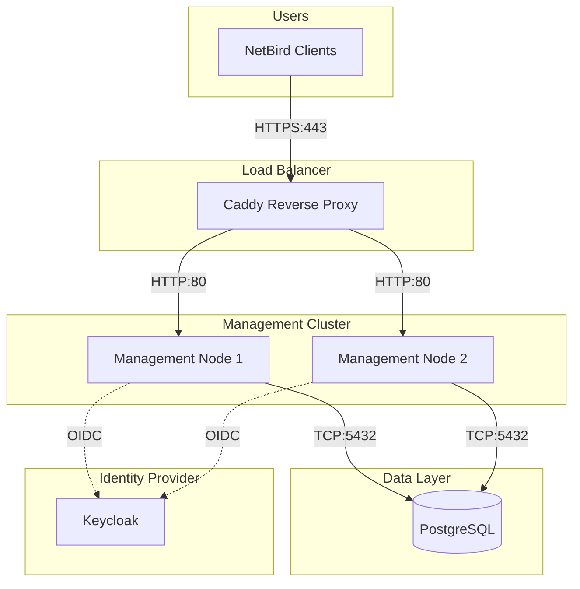

# Architecture Overview

This document provides a high-level overview of the NetBird infrastructure automation architecture.

## System Architecture

## Components

### Management Nodes
- **Purpose**: Run NetBird Management, Signal, and Dashboard services
- **Configuration**: Managed by Ansible
- **Deployment**: Docker containers on existing VMs
- **Network**: Private IP binding for security

### Reverse Proxy (Load Balancer)
- **Technology**: Caddy
- **Purpose**: HTTPS termination and load balancing
- **Features**: Automatic HTTPS via Let's Encrypt/ACME
- **Network**: Public-facing with strict firewall rules

### Database Layer
- **Options**: SQLite (single-node), PostgreSQL (HA), MySQL (external)
- **Management**: Either Terraform-provisioned or existing instance
- **Backups**: Automated with configurable retention

### Identity Provider
- **Technology**: Keycloak
- **Configuration**: Automated realm and client setup via Terraform
- **Integration**: OIDC authentication for NetBird dashboard

## Deployment Model

This infrastructure assumes:
- **Existing VMs** across AWS, GCP, Azure, or on-premises
- **Discovery-based**: Terraform discovers VMs via tags/labels
- **Configuration-only**: Ansible configures software, doesn't provision infrastructure
- **Multi-cloud**: Unified approach across cloud providers

## Security Model

### Defense in Depth
1. **Cloud Security Groups**: Network-level isolation
2. **Host Firewalls (UFW)**: Host-level protection with rule preservation
3. **Private IP Binding**: Services only listen on private interfaces
4. **TLS Everywhere**: Encrypted communication

See [security-hardening.md](./operations-book/security-hardening.md) for details.

## Related Documentation

- [Security Hardening](./operations-book/security-hardening.md) - Security best practices
- [Deployment Guide](./runbooks/ansible-stack/deployment.md) - Step-by-step deployment
- [Configuration Reference](../infrastructure/ansible-stack/README.md) - Variables and settings
