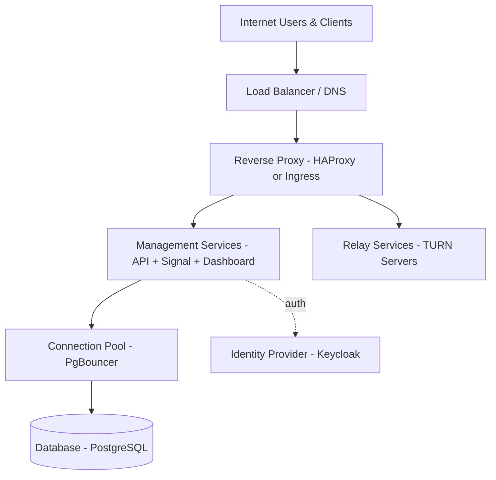
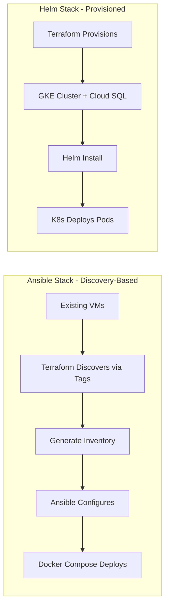

# NetBird Infrastructure Architecture

This document provides a high-level overview of the NetBird infrastructure automation architecture.

## Overview

NetBird is a WireGuard-based VPN platform that provides secure peer-to-peer connectivity. This repository automates the deployment of NetBird's management infrastructure using two different approaches: VM-based (Ansible) and Kubernetes-based (Helm).

## Deployment Options

Click to expand High-Level Architecture

**Ansible Stack**: VM-based deployment using Terraform + Ansible + Docker Compose
- Best for: Multi-cloud, on-premise, VM-based infrastructure
- [Detailed Documentation](../infrastructure/ansible-stack/README.md)

**Helm Stack**: Kubernetes deployment using Helm charts
- Best for: Cloud-native, auto-scaling, Kubernetes environments
- [Detailed Documentation](../infrastructure/helm-stack/README.md)

## Common Components

### Management Services
- **Management API**: Core NetBird management service (REST API + gRPC, ports 8081/10000)
- **Signal Server**: WebRTC signaling for peer connections (WebSocket, port 8083)
- **Dashboard**: Web UI for administration (React SPA, port 8082)

### Identity Provider
- **Keycloak**: OIDC authentication and user management
- **Configuration**: Automated realm (`netbird`) and client setup via Terraform

### Database
- **Options**: SQLite (development), PostgreSQL (production)
- **High Availability**: PgBouncer connection pooling for transaction-level pooling (Ansible stack)

### Networking
- **Load Balancing**: HAProxy (Ansible) or Ingress (Kubernetes) with health checks and failover
- **TLS**: Automatic certificates via ACME/Let's Encrypt with 90-day lifecycle
- **Relay Servers**: Optional TURN servers for NAT traversal (Coturn, ports 3478, 49152-65535, 33080)

## Security Architecture

1. **Network Security**: Cloud security groups and firewall rules
   - Ingress rules: Only ports 80, 443, 3478, 33080
   - Egress rules: Restricted to necessary services
   - Private networking for internal communication

2. **Host Firewalls**: UFW on VMs (Ansible stack)
   - Default deny policy
   - Explicit allow rules per service
   - SSH access restricted to management IPs

3. **Private Networking**: Services bind to private IPs
   - Management services on private network
   - Database on private network
   - Only reverse proxy exposed publicly

4. **TLS Encryption**: All communication encrypted
   - TLS 1.2+ minimum
   - Strong cipher suites only
   - Perfect forward secrecy

5. **Zero Trust**: Identity-based access control
   - OIDC authentication required
   - JWT token validation
   - Role-based authorization

See [Security Hardening Guide](./operations-book/security-hardening.md) for detailed security practices.

## Deployment Model

Click to expand Deployment Workflow Comparison

### Discovery-Based (Ansible Stack)

- Terraform discovers existing VMs via cloud provider tags/labels
- Ansible configures software on discovered infrastructure
- No infrastructure provisioning - uses existing resources
- Multi-cloud support (AWS, GCP, Azure, on-premise)
- Idempotent deployments

### Provisioned (Helm Stack)

- Terraform provisions GKE cluster and Cloud SQL
- Helm deploys NetBird services
- Fully automated infrastructure and application deployment
- Cloud-native patterns (auto-scaling, self-healing)
- Kubernetes-native monitoring and logging

## Related Documentation

### Operations
- [Operations Book](./operations-book/README.md) - Strategic operations guidance
- [Runbooks](./runbooks/README.md) - Tactical deployment procedures
- [Security Hardening](./operations-book/security-hardening.md) - Security best practices

### Deployment
- [Ansible Stack Deployment](./runbooks/ansible-stack/deployment.md)
- [Helm Stack Deployment](./runbooks/helm-stack/deployment.md)
- [Configuration Reference](../infrastructure/ansible-stack/README.md)

### Use Cases
- [Use Cases Guide](./use-cases.md) - Common deployment scenarios 