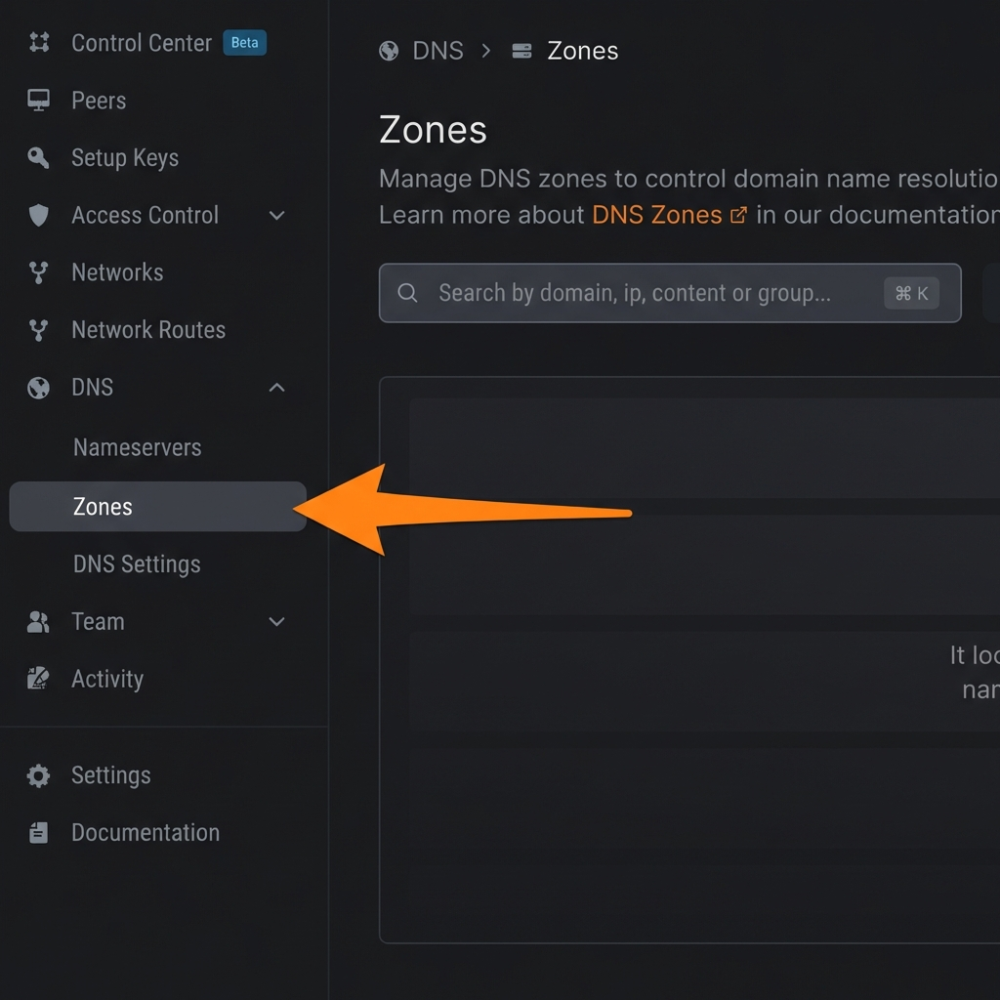

# Secure Application Access with NetBird DNS Zones

NetBird DNS Zones let you assign custom domains (e.g., app.mycompany.local) to your app’s public IP that only resolve for users on your NetBird network, keeping your application secure and invisible to the public internet. In this guide, you’ll learn how to configure DNS Zones with Distribution Groups for safe, private app access.


## Why Use NetBird DNS Zones Instead of Public DNS?

| Aspects | NetBird DNS Zones | Traditional DNS Provider |
|---------|-------------------|--------------------------|
| **Cost** | Free (included with NetBird) | $10-50/year per domain |
| **Privacy** | Only visible to your network | Publicly visible |
| **Management** | Centralized in NetBird dashboard | Separate DNS provider interface |
| **Access Control** | Group-based distribution | No built-in access control |
| **Setup Time** | Minutes | Hours to days (domain registration) |

## Prerequisites

Before starting, ensure you have:
-   **A NetBird Environment**: You must have a NetBird instance ready. This can be:
    -   **NetBird Cloud**: The managed service at [app.netbird.io](https://app.netbird.io/).
    -   **Self-Hosted NetBird**: Your own deployment of the NetBird Management service.
-   **NetBird Agent Installed**: On client devices (laptops, phones, etc.) that need to access your application.
    -   *Installation Guide:* [NetBird Installation](https://docs.netbird.io/how-to/getting-started#installation)
-   **An Application with a Public IP**: A web service running on a server with a public IP address (e.g., `3.124.6.78`).
    -   **Note**: The server hosting your application does **NOT** need to be on NetBird. DNS zones can resolve to any IP address.

---

## Step 1: Create Distribution Groups

**Distribution Groups** control who can resolve your custom DNS zones. This is the primary security mechanism for DNS zones.

1.  **Log in** to your NetBird Dashboard.
2.  Navigate to the **Peers** section.
3.  **Create User Groups**:
    -   Create groups for your team members, e.g., `dev-team`, `sre-team`, or `contractors`.
    -   Assign the relevant peers (user devices) to these groups.
    -   You can also use the default `All` group if everyone should have access.

**Example:**
- `dev-team`: Full-time developers who need access to all internal tools.
- `contractors`: External contractors who only need access to specific applications.

---

## Step 2: Configure DNS Zone

Now you'll create a custom domain and point it to your application's public IP.

### Navigating to DNS Zones

In your NetBird Dashboard, navigate to **DNS** > **DNS Zones** from the left sidebar:



### Creating a DNS Zone

1.  Click **Add Zone**.
2.  **Zone Settings**:
    -   **Domain**: Enter your desired private domain (e.g., `mycompany.local`, `internal.dev`, or `apps.corp`)
    -   **Description**: e.g., "Private DNS for internal applications"
    -   **Distribution Groups**: Select which groups should be able to resolve this domain.
        -   **For Maximum Security**: Only select specific groups like `dev-team`.
        -   **For Convenience**: Select `All` to allow all NetBird users to resolve the domain.
4.  **Add a DNS Record**:
    -   Click **Add Record** within your new zone.
    -   **Name**: Enter the subdomain (e.g., `wiki` for `wiki.mycompany.local`).
    -   **Type**: `A` (IPv4).
    -   **Value**: Enter the **public IP address** of your application server (e.g., `3.124.6.78`).
    -   **TTL**: `300` (default is fine).
    -   Click **Save**

**Result**: Users in the selected distribution groups can now resolve `wiki.mycompany.local` to your application's public IP (`3.124.6.78`).

### Understanding Distribution Groups

**Who can resolve the domain?**
- Users in the distribution group: ✅ DNS resolves to the IP
- Users NOT in the distribution group: ❌ DNS resolution fails (domain not found)

**Example Scenario:**
- **Alice** (in `dev-team`): Runs `nslookup wiki.mycompany.local` → Returns `3.124.6.78` ✅
- **Bob** (in `marketing` - not in distribution group): Runs `nslookup wiki.mycompany.local` → "domain not found" ❌

---

## Step 3: Verification

To verify your setup is working correctly, perform the following tests.

### 1. Test DNS Resolution (Authorized User)
From a device in the distribution group:
```bash
# Replace with your actual domain
nslookup wiki.mycompany.local
```
**Success Criteria**: The command returns your application's public IP address (e.g., `3.124.6.78`).

### 2. Test Application Access
From the same device:
```bash
curl -v http://wiki.mycompany.local
```
**Success Criteria**: You receive a valid HTTP response (e.g., `200 OK`) and HTML content from your application.

### 3. Test DNS Blocking (Unauthorized User)
From a device **NOT** in the distribution group:
```bash
nslookup wiki.mycompany.local
```
**Success Criteria**: The DNS query should fail with "server can't find wiki.mycompany.local: NXDOMAIN" or similar error.

---

> [!IMPORTANT]
> **NetBird Network Requirement**: To access applications using NetBird DNS Zones, both the client device and the application server must have connectivity. The client device must be connected to the NetBird network with the NetBird agent installed and running. DNS resolution only works for devices in the assigned distribution group.

---

## Summary

You have now configured:
1.  **Distribution Groups** to control who can resolve your custom domains.
2.  **Private DNS Zones** that map friendly names (e.g., `wiki.mycompany.local`) to your application's public IP.
3.  **Cost-effective DNS management** without purchasing domains from DNS providers.
4.  **Secure access** where only NetBird-connected devices in the right group can discover and access your applications.

Your distributed team can now access applications using easy-to-remember domain names. The security is provided by requiring both NetBird network membership AND distribution group membership, ensuring only authorized users can discover these services.
