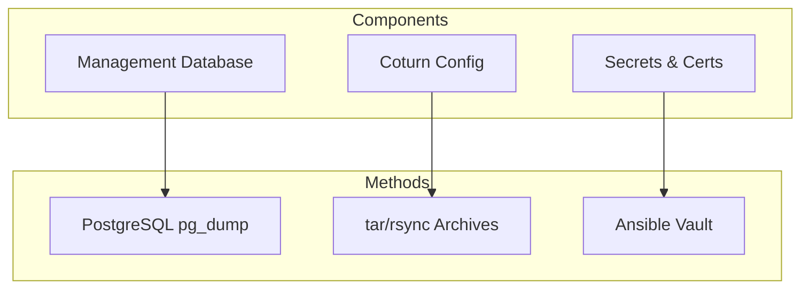

# NetBird Ansible Stack Backup and Restore Runbook

Complete backup and restore procedures for NetBird Ansible deployment.

## Overview



### Backup Components

| Component | Data Type | Backup Method | Priority |
|-----------|-----------|---------------|----------|
| **Management DB** | Peers, users, networks | pg_dump / SQLite backup | Critical |
| **Coturn Config** | turnserver.conf | tar archive | High |
| **Certificates** | TLS certs, CA | tar archive | Critical |
| **Docker Volumes** | Persistent data | docker volume backup | Critical |
| **Configuration** | Ansible inventory, vars | Git/tar archive | High |
| **Keycloak Data** | Users, realms | Keycloak export | Critical |

---

## Backup Procedures

### Database Backup

#### PostgreSQL Backup

**On management node:**
```bash
# SSH to management node
ssh ubuntu@<management-node-ip>

# Create backup directory
sudo mkdir -p /var/backups/netbird/$(date +%Y%m%d)

# Backup PostgreSQL database
sudo docker exec netbird-management pg_dump \
  -U netbird -d netbird \
  > /var/backups/netbird/$(date +%Y%m%d)/netbird-db-$(date +%Y%m%d_%H%M).sql

# Compress backup
sudo gzip /var/backups/netbird/$(date +%Y%m%d)/netbird-db-$(date +%Y%m%d_%H%M).sql

# Copy to backup server
scp /var/backups/netbird/$(date +%Y%m%d)/netbird-db-$(date +%Y%m%d_%H%M).sql.gz \
  backup-server:/backups/netbird/
```

#### SQLite Backup

**For SQLite deployments:**
```bash
# Stop management service
sudo docker-compose -f /opt/netbird/docker-compose.yml stop management

# Backup SQLite database
sudo cp /var/lib/netbird/store.db \
  /var/backups/netbird/$(date +%Y%m%d)/netbird-store-$(date +%Y%m%d).db

# Start management service
sudo docker-compose -f /opt/netbird/docker-compose.yml start management

# Copy to backup server
scp /var/backups/netbird/$(date +%Y%m%d)/netbird-store-$(date +%Y%m%d).db \
  backup-server:/backups/netbird/
```

### Configuration Backup

**Backup NetBird configuration:**
```bash
# On management node
sudo tar -czf /var/backups/netbird/$(date +%Y%m%d)/netbird-config-$(date +%Y%m%d).tar.gz \
  /opt/netbird/ \
  /etc/netbird/ \
  --exclude=/opt/netbird/data

# Copy to backup server
scp /var/backups/netbird/$(date +%Y%m%d)/netbird-config-$(date +%Y%m%d).tar.gz \
  backup-server:/backups/netbird/
```

**Backup Coturn configuration:**
```bash
# On relay node
sudo tar -czf /var/backups/netbird/$(date +%Y%m%d)/coturn-config-$(date +%Y%m%d).tar.gz \
  /etc/coturn/ \
  /opt/netbird/coturn/

# Copy to backup server
scp /var/backups/netbird/$(date +%Y%m%d)/coturn-config-$(date +%Y%m%d).tar.gz \
  backup-server:/backups/netbird/
```

### Docker Volumes Backup

**Backup Docker volumes:**
```bash
# List volumes
sudo docker volume ls | grep netbird

# Backup each volume
for volume in $(sudo docker volume ls -q | grep netbird); do
  sudo docker run --rm \
    -v $volume:/data \
    -v /var/backups/netbird/$(date +%Y%m%d):/backup \
    alpine tar -czf /backup/$volume-$(date +%Y%m%d).tar.gz -C /data .
done
```

### Certificates Backup

**Backup TLS certificates:**
```bash
# On proxy node (Caddy)
sudo tar -czf /var/backups/netbird/$(date +%Y%m%d)/caddy-certs-$(date +%Y%m%d).tar.gz \
  /var/lib/caddy/certificates/

# On proxy node (HAProxy with acme.sh)
sudo tar -czf /var/backups/netbird/$(date +%Y%m%d)/acme-certs-$(date +%Y%m%d).tar.gz \
  /root/.acme.sh/

# Copy to backup server
scp /var/backups/netbird/$(date +%Y%m%d)/*-certs-*.tar.gz \
  backup-server:/backups/netbird/
```

### Ansible Configuration Backup

**Backup Ansible inventory and variables:**
```bash
# On control machine
cd /path/to/netbird-project

# Backup configuration
tar -czf netbird-ansible-config-$(date +%Y%m%d).tar.gz \
  configuration/ansible/ \
  infrastructure/ansible-stack/terraform.tfvars \
  infrastructure/ansible-stack/terraform.tfstate

# Copy to backup server
scp netbird-ansible-config-$(date +%Y%m%d).tar.gz \
  backup-server:/backups/netbird/
```

### Automated Backup Script

**Create backup script:**
```bash
#!/bin/bash
# /usr/local/bin/netbird-backup.sh

set -e

BACKUP_DIR="/var/backups/netbird/$(date +%Y%m%d)"
BACKUP_SERVER="backup-server:/backups/netbird/"

# Create backup directory
mkdir -p $BACKUP_DIR

# Backup database
if docker ps | grep -q netbird-management; then
  if docker exec netbird-management which pg_dump > /dev/null 2>&1; then
    # PostgreSQL backup
    docker exec netbird-management pg_dump -U netbird -d netbird \
      > $BACKUP_DIR/netbird-db-$(date +%Y%m%d_%H%M).sql
    gzip $BACKUP_DIR/netbird-db-$(date +%Y%m%d_%H%M).sql
  else
    # SQLite backup
    docker-compose -f /opt/netbird/docker-compose.yml stop management
    cp /var/lib/netbird/store.db $BACKUP_DIR/netbird-store-$(date +%Y%m%d).db
    docker-compose -f /opt/netbird/docker-compose.yml start management
  fi
fi

# Backup configuration
tar -czf $BACKUP_DIR/netbird-config-$(date +%Y%m%d).tar.gz \
  /opt/netbird/ \
  /etc/netbird/ \
  --exclude=/opt/netbird/data

# Backup certificates
if [ -d /var/lib/caddy/certificates ]; then
  tar -czf $BACKUP_DIR/caddy-certs-$(date +%Y%m%d).tar.gz \
    /var/lib/caddy/certificates/
fi

# Copy to backup server
rsync -avz $BACKUP_DIR/ $BACKUP_SERVER

# Cleanup old backups (keep 30 days)
find /var/backups/netbird/ -type d -mtime +30 -exec rm -rf {} \;

echo "Backup completed: $BACKUP_DIR"
```

**Install backup cron job:**
```bash
# Make script executable
sudo chmod +x /usr/local/bin/netbird-backup.sh

# Add to crontab (daily at 2 AM)
sudo crontab -e
# Add line:
0 2 * * * /usr/local/bin/netbird-backup.sh >> /var/log/netbird-backup.log 2>&1
```

---

## Restore Procedures

### Restore Database

#### PostgreSQL Restore

**On management node:**
```bash
# Stop management service
sudo docker-compose -f /opt/netbird/docker-compose.yml stop management

# Decompress backup
gunzip /var/backups/netbird/YYYYMMDD/netbird-db-YYYYMMDD_HHMM.sql.gz

# Restore database
sudo docker exec -i netbird-postgresql psql -U netbird -d netbird \
  < /var/backups/netbird/YYYYMMDD/netbird-db-YYYYMMDD_HHMM.sql

# Start management service
sudo docker-compose -f /opt/netbird/docker-compose.yml start management

# Verify
sudo docker logs netbird-management
```

#### SQLite Restore

**For SQLite deployments:**
```bash
# Stop management service
sudo docker-compose -f /opt/netbird/docker-compose.yml stop management

# Restore database
sudo cp /var/backups/netbird/YYYYMMDD/netbird-store-YYYYMMDD.db \
  /var/lib/netbird/store.db

# Fix permissions
sudo chown netbird:netbird /var/lib/netbird/store.db

# Start management service
sudo docker-compose -f /opt/netbird/docker-compose.yml start management
```

### Restore Configuration

**Restore NetBird configuration:**
```bash
# Stop services
sudo docker-compose -f /opt/netbird/docker-compose.yml down

# Restore configuration
sudo tar -xzf /var/backups/netbird/YYYYMMDD/netbird-config-YYYYMMDD.tar.gz -C /

# Start services
sudo docker-compose -f /opt/netbird/docker-compose.yml up -d

# Verify
sudo docker ps
```

### Restore Certificates

**Restore TLS certificates:**
```bash
# Stop proxy service
sudo docker-compose -f /opt/netbird/docker-compose.yml stop caddy

# Restore certificates
sudo tar -xzf /var/backups/netbird/YYYYMMDD/caddy-certs-YYYYMMDD.tar.gz -C /

# Fix permissions
sudo chown -R caddy:caddy /var/lib/caddy/

# Start proxy service
sudo docker-compose -f /opt/netbird/docker-compose.yml start caddy
```

### Restore Docker Volumes

**Restore Docker volumes:**
```bash
# Stop services
sudo docker-compose -f /opt/netbird/docker-compose.yml down

# Restore each volume
for backup in /var/backups/netbird/YYYYMMDD/*-volume-*.tar.gz; do
  volume=$(basename $backup | sed 's/-[0-9]*.tar.gz//')
  sudo docker run --rm \
    -v $volume:/data \
    -v /var/backups/netbird/YYYYMMDD:/backup \
    alpine tar -xzf /backup/$(basename $backup) -C /data
done

# Start services
sudo docker-compose -f /opt/netbird/docker-compose.yml up -d
```

---

## Disaster Recovery

### Full Disaster Recovery

**Prerequisites:**
- [ ] Backup files available
- [ ] Fresh servers provisioned
- [ ] Ansible inventory updated
- [ ] SSH access configured

**Step 1: Deploy infrastructure**
```bash
cd infrastructure/ansible-stack

# Initialize Terraform
terraform init

# Apply infrastructure
terraform apply -auto-approve
```

**Step 2: Run Ansible deployment**
```bash
cd configuration/ansible

# Deploy NetBird
ansible-playbook -i inventory/terraform_inventory.yaml playbooks/site.yml
```

**Step 3: Stop services for restore**
```bash
# On all nodes
ansible all -i inventory/terraform_inventory.yaml \
  -m shell -a "cd /opt/netbird && docker-compose down"
```

**Step 4: Restore backups**
```bash
# Copy backups to nodes
ansible-playbook -i inventory/terraform_inventory.yaml \
  playbooks/restore-backups.yml \
  -e backup_date=YYYYMMDD

# Or manually:
scp /backups/netbird/YYYYMMDD/* ubuntu@<management-node>:/var/backups/netbird/YYYYMMDD/
```

**Step 5: Restore database**
```bash
# Follow Restore Database procedure on management node
```

**Step 6: Restore configuration**
```bash
# Follow R02 - Restore Configuration procedure on all nodes
```

**Step 7: Start services**
```bash
ansible all -i inventory/terraform_inventory.yaml \
  -m shell -a "cd /opt/netbird && docker-compose up -d"
```

**Step 8: Verify recovery**
```bash
# Check services
ansible all -i inventory/terraform_inventory.yaml \
  -m shell -a "docker ps"

# Check management API
curl -sk https://netbird.example.com/api/status

# Check dashboard
curl -sk https://netbird.example.com
```

### Recovery Checklist

| Check | Command | Expected |
|-------|---------|----------|
| All nodes accessible | `ansible all -m ping` | pong |
| Docker running | `docker ps` | Containers running |
| Database accessible | `psql connection test` | Success |
| Management API | `curl /api/status` | 200 OK |
| Dashboard accessible | Browser test | Login works |
| Peers registered | Check peer count | Matches backup |

---

## Retention Policy

### Retention Schedule

| Data Type | Retention | Backup Frequency | Storage Location |
|-----------|-----------|------------------|------------------|
| Database | 30 days | Daily | NFS/S3 |
| Configuration | 90 days | Weekly | NFS/S3 |
| Certificates | Forever | Before renewal | Encrypted storage |
| Docker volumes | 30 days | Daily | NFS/S3 |
| Ansible config | Forever | Before changes | Git |

---

## Troubleshooting

### Backup Issues

| Issue | Cause | Solution |
|-------|-------|----------|
| pg_dump fails | Container not running | Check Docker status |
| Permission denied | Wrong user | Use sudo |
| Disk full | Insufficient space | Clean old backups |
| Network timeout | Slow connection | Use compression |

### Restore Issues

| Issue | Cause | Solution |
|-------|-------|----------|
| Database restore fails | Version mismatch | Use compatible backup |
| Container won't start | Config error | Check docker logs |
| Permission denied | Wrong ownership | Fix file permissions |
| Service unavailable | Firewall blocking | Check firewall rules |

---

## Related Documentation

| Document | Description |
|----------|-------------|
| [Deployment Runbook](deployment.md) | Fresh deployment |
| [Upgrade Runbook](upgrade.md) | Upgrade procedures |
| [Troubleshooting](troubleshooting-restoration.md) | Common issues |
| [Operations Book](../../operations-book/ansible-stack/README.md) | Operations guide |

## Revision History

| Date | Version | Author | Changes |
|------|---------|--------|---------|
| 2024-02 | 1.0 | Platform Team | Initial version |
