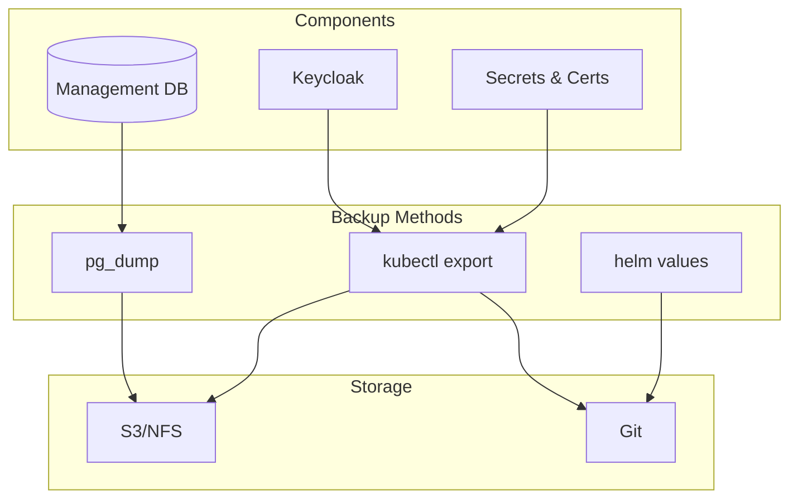

# NetBird Backup and Restore Runbook

Complete backup and restore procedures for NetBird Helm deployment on Kubernetes.

## Overview



### Backup Components

| Component | Data Type | Backup Method | Priority |
|-----------|-----------|---------------|----------|
| Management DB | Peers, users, networks | pg_dump / SQLite | Critical |
| Keycloak Data | Users, realms, clients | Keycloak export | Critical |
| Certificates | TLS certs, CA | kubectl export | Critical |
| Secrets | Passwords, tokens | kubectl export | Critical |
| Helm Values | Configuration | helm get values | High |
| Terraform State | Infrastructure state | terraform state pull | High |

---

## Backup Procedures

### Database Backup

#### PostgreSQL Backup

**Create backup:**
```bash
# Get database credentials
DB_HOST=$(kubectl get secret -n netbird netbird-postgresql \
  -o jsonpath='{.data.host}' | base64 -d)
DB_USER=$(kubectl get secret -n netbird netbird-postgresql \
  -o jsonpath='{.data.username}' | base64 -d)
DB_PASS=$(kubectl get secret -n netbird netbird-postgresql \
  -o jsonpath='{.data.password}' | base64 -d)
DB_NAME=$(kubectl get secret -n netbird netbird-postgresql \
  -o jsonpath='{.data.database}' | base64 -d)

# Create backup directory
mkdir -p ./backups/$(date +%Y%m%d)

# Backup database
kubectl exec -n netbird deployment/netbird-management -- \
  pg_dump -h $DB_HOST -U $DB_USER -d $DB_NAME \
  > ./backups/$(date +%Y%m%d)/netbird-db-$(date +%Y%m%d_%H%M).sql

# Compress backup
gzip ./backups/$(date +%Y%m%d)/netbird-db-$(date +%Y%m%d_%H%M).sql
```

#### SQLite Backup

**For SQLite deployments:**
```bash
# Copy SQLite database file
kubectl exec -n netbird deployment/netbird-management -- \
  cat /var/lib/netbird/store.db > ./backups/$(date +%Y%m%d)/netbird-store-$(date +%Y%m%d).db

# Verify backup
file ./backups/$(date +%Y%m%d)/netbird-store-$(date +%Y%m%d).db
```

### B02 - Keycloak Backup

**Export Keycloak realm:**
```bash
# Get Keycloak admin credentials
KC_ADMIN=$(kubectl get secret -n keycloak keycloak-admin \
  -o jsonpath='{.data.username}' | base64 -d)
KC_PASS=$(kubectl get secret -n keycloak keycloak-admin \
  -o jsonpath='{.data.password}' | base64 -d)
KC_URL=$(kubectl get ingress -n keycloak keycloak \
  -o jsonpath='{.spec.rules[0].host}')

# Export NetBird realm
kubectl exec -n keycloak statefulset/keycloak-0 -- \
  /opt/keycloak/bin/kc.sh export \
  --realm netbird \
  --file /tmp/netbird-realm-$(date +%Y%m%d).json

# Copy export to local
kubectl cp keycloak/keycloak-0:/tmp/netbird-realm-$(date +%Y%m%d).json \
  ./backups/$(date +%Y%m%d)/netbird-realm-$(date +%Y%m%d).json
```

### B03 - Secrets Backup

**Export all NetBird secrets:**
```bash
# Export all secrets
kubectl get secrets -n netbird -o yaml > ./backups/$(date +%Y%m%d)/netbird-secrets-$(date +%Y%m%d).yaml

# Export critical secrets individually
kubectl get secret netbird-tls -n netbird -o yaml > ./backups/$(date +%Y%m%d)/netbird-tls-$(date +%Y%m%d).yaml
kubectl get secret netbird-postgresql -n netbird -o yaml > ./backups/$(date +%Y%m%d)/netbird-postgresql-$(date +%Y%m%d).yaml
kubectl get secret netbird-keycloak-client -n netbird -o yaml > ./backups/$(date +%Y%m%d)/netbird-keycloak-$(date +%Y%m%d).yaml

# Encrypt backups (recommended)
gpg --symmetric --cipher-algo AES256 ./backups/$(date +%Y%m%d)/netbird-secrets-$(date +%Y%m%d).yaml
```

### B04 - Configuration Backup

**Export Helm values:**
```bash
# Get current Helm values
helm get values netbird -n netbird > ./backups/$(date +%Y%m%d)/helm-values-$(date +%Y%m%d).yaml
helm get values netbird -n netbird --all > ./backups/$(date +%Y%m%d)/helm-values-all-$(date +%Y%m%d).yaml

# Export Terraform state (if using Terraform)
cd infrastructure/helm-stack
terraform state pull > ../../backups/$(date +%Y%m%d)/terraform-state-$(date +%Y%m%d).json
```

### B05 - Automated Backup CronJob

**Create backup CronJob:**
```yaml
apiVersion: batch/v1
kind: CronJob
metadata:
  name: netbird-backup
  namespace: netbird
spec:
  schedule: "0 2 * * *"  # Daily at 2 AM
  concurrencyPolicy: Forbid
  successfulJobsHistoryLimit: 3
  failedJobsHistoryLimit: 3
  jobTemplate:
    spec:
      template:
        spec:
          serviceAccountName: netbird-backup-sa
          containers:
          - name: backup
            image: postgres:15-alpine
            command:
            - /bin/sh
            - -c
            - |
              # Backup PostgreSQL database
              pg_dump -h $DB_HOST -U $DB_USER -d $DB_NAME \
                > /backup/netbird-db-$(date +%Y%m%d_%H%M).sql

              # Compress backup
              gzip /backup/netbird-db-$(date +%Y%m%d_%H%M).sql

              # Upload to S3 (optional)
              # aws s3 cp /backup/netbird-db-$(date +%Y%m%d_%H%M).sql.gz \
              #   s3://netbird-backups/$(date +%Y%m%d)/
            env:
            - name: DB_HOST
              valueFrom:
                secretKeyRef:
                  name: netbird-postgresql
                  key: host
            - name: DB_USER
              valueFrom:
                secretKeyRef:
                  name: netbird-postgresql
                  key: username
            - name: DB_NAME
              valueFrom:
                secretKeyRef:
                  name: netbird-postgresql
                  key: database
            - name: PGPASSWORD
              valueFrom:
                secretKeyRef:
                  name: netbird-postgresql
                  key: password
            volumeMounts:
            - name: backup-storage
              mountPath: /backup
          volumes:
          - name: backup-storage
            persistentVolumeClaim:
              claimName: netbird-backup-pvc
          restartPolicy: OnFailure
```

**Apply CronJob:**
```bash
kubectl apply -f netbird-backup-cronjob.yaml
```

---

## Restore Procedures

### R01 - Restore Database

#### PostgreSQL Restore

**Restore from backup:**
```bash
# Get database credentials
DB_HOST=$(kubectl get secret -n netbird netbird-postgresql \
  -o jsonpath='{.data.host}' | base64 -d)
DB_USER=$(kubectl get secret -n netbird netbird-postgresql \
  -o jsonpath='{.data.username}' | base64 -d)
DB_PASS=$(kubectl get secret -n netbird netbird-postgresql \
  -o jsonpath='{.data.password}' | base64 -d)
DB_NAME=$(kubectl get secret -n netbird netbird-postgresql \
  -o jsonpath='{.data.database}' | base64 -d)

# Decompress backup
gunzip ./backups/YYYYMMDD/netbird-db-YYYYMMDD_HHMM.sql.gz

# Scale down management service
kubectl scale deployment/netbird-management -n netbird --replicas=0

# Restore database
kubectl exec -n netbird deployment/netbird-management -- \
  psql -h $DB_HOST -U $DB_USER -d $DB_NAME \
  < ./backups/YYYYMMDD/netbird-db-YYYYMMDD_HHMM.sql

# Scale up management service
kubectl scale deployment/netbird-management -n netbird --replicas=1
```

#### SQLite Restore

**For SQLite deployments:**
```bash
# Scale down management service
kubectl scale deployment/netbird-management -n netbird --replicas=0

# Copy backup to pod
kubectl cp ./backups/YYYYMMDD/netbird-store-YYYYMMDD.db \
  netbird/netbird-management-0:/var/lib/netbird/store.db

# Scale up management service
kubectl scale deployment/netbird-management -n netbird --replicas=1
```

### R02 - Restore Keycloak

**Import Keycloak realm:**
```bash
# Copy backup to pod
kubectl cp ./backups/YYYYMMDD/netbird-realm-YYYYMMDD.json \
  keycloak/keycloak-0:/tmp/netbird-realm.json

# Import realm
kubectl exec -n keycloak statefulset/keycloak-0 -- \
  /opt/keycloak/bin/kc.sh import \
  --file /tmp/netbird-realm.json \
  --override true

# Restart Keycloak
kubectl rollout restart statefulset/keycloak -n keycloak
```

### R03 - Restore Secrets

**Restore from backup:**
```bash
# Decrypt if encrypted
gpg -d ./backups/YYYYMMDD/netbird-secrets-YYYYMMDD.yaml.gpg \
  > ./backups/YYYYMMDD/netbird-secrets-YYYYMMDD.yaml

# Apply secrets
kubectl apply -f ./backups/YYYYMMDD/netbird-secrets-YYYYMMDD.yaml

# Or restore individual secrets
kubectl apply -f ./backups/YYYYMMDD/netbird-tls-YYYYMMDD.yaml
kubectl apply -f ./backups/YYYYMMDD/netbird-postgresql-YYYYMMDD.yaml
kubectl apply -f ./backups/YYYYMMDD/netbird-keycloak-YYYYMMDD.yaml

# Restart pods to pick up new secrets
kubectl rollout restart deployment/netbird-management -n netbird
kubectl rollout restart deployment/netbird-signal -n netbird
kubectl rollout restart deployment/netbird-dashboard -n netbird
```

---

## Disaster Recovery

### DR01 - Full Disaster Recovery

**Prerequisites:**
- [ ] Backup files available
- [ ] Clean Kubernetes cluster
- [ ] Helm chart access
- [ ] Storage provisioner working
- [ ] Keycloak instance available

**Step 1: Create namespace and restore secrets**
```bash
kubectl create namespace netbird

# Restore secrets first
kubectl apply -f ./backups/YYYYMMDD/netbird-secrets-YYYYMMDD.yaml
```

**Step 2: Deploy NetBird with Helm**
```bash
cd infrastructure/helm-stack

# Initialize Terraform
terraform init

# Apply infrastructure
terraform apply -auto-approve
```

**Step 3: Wait for pods to be ready**
```bash
kubectl wait --for=condition=ready pod \
  -l app.kubernetes.io/instance=netbird \
  -n netbird \
  --timeout=600s
```

**Step 4: Restore database**
```bash
# Follow R01 - Restore Database procedure
```

**Step 5: Restore Keycloak realm**
```bash
# Follow R02 - Restore Keycloak procedure
```

**Step 6: Verify recovery**
```bash
# Check all pods running
kubectl get pods -n netbird

# Check management API
kubectl exec -n netbird deployment/netbird-management -- \
  curl -sk https://localhost:443/api/status

# Check dashboard access
kubectl port-forward -n netbird svc/netbird-dashboard 8080:80
# Access: http://localhost:8080
```

### DR02 - Recovery Checklist

| Check | Command | Expected |
|-------|---------|----------|
| Namespace exists | `kubectl get ns netbird` | Active |
| Secrets restored | `kubectl get secrets -n netbird` | All present |
| Pods running | `kubectl get pods -n netbird` | All Running |
| Database accessible | `psql connection test` | Success |
| Management API | `curl /api/status` | 200 OK |
| Dashboard accessible | Browser test | Login works |
| Peers registered | Check peer count | Matches backup |

---

## Retention Policy

### Retention Schedule

| Data Type | Retention | Backup Frequency | Storage Location |
|-----------|-----------|------------------|------------------|
| Database | 30 days | Daily | S3/NFS |
| Keycloak | 30 days | Weekly | S3/NFS |
| Secrets | Forever | Before changes | Encrypted storage |
| Helm values | Forever | Before changes | Git |
| Terraform state | Forever | After changes | S3 backend |

### Backup Cleanup

**Delete old backups (keep last 30 days):**
```bash
# Find backups older than 30 days
find ./backups -type d -mtime +30 -name "202*"

# Delete old backups
find ./backups -type d -mtime +30 -name "202*" -exec rm -rf {} \;
```

---

## Troubleshooting

### TS1 - Backup Issues

| Issue | Cause | Solution |
|-------|-------|----------|
| pg_dump fails | Connection refused | Check database pod status |
| Backup too large | Large database | Use compression, incremental backups |
| Permission denied | RBAC issues | Check ServiceAccount permissions |
| Slow backup | Large data | Schedule during off-hours |

**Debug commands:**
```bash
# Check database connectivity
kubectl exec -n netbird deployment/netbird-management -- \
  pg_isready -h $DB_HOST -U $DB_USER

# Check disk space
kubectl exec -n netbird deployment/netbird-management -- df -h
```

### TS2 - Restore Issues

| Issue | Cause | Solution |
|-------|-------|----------|
| Restore fails | Version mismatch | Use compatible backup |
| Database locked | Active connections | Scale down services first |
| Permission denied | Wrong credentials | Verify secret values |
| Data corruption | Incomplete backup | Use earlier backup |

---

## Related Documentation

| Document | Description |
|----------|-------------|
| [Deployment Runbook](deployment.md) | Fresh deployment |
| [Upgrade Runbook](upgrade.md) | Upgrade procedures |
| [Troubleshooting](troubleshooting.md) | Common issues |
| [Operations Book](../../operations-book/helm-stack/README.md) | Operations guide |

## Revision History

| Date | Version | Author | Changes |
|------|---------|--------|---------|
| 2024-02 | 1.0 | Platform Team | Initial version |
