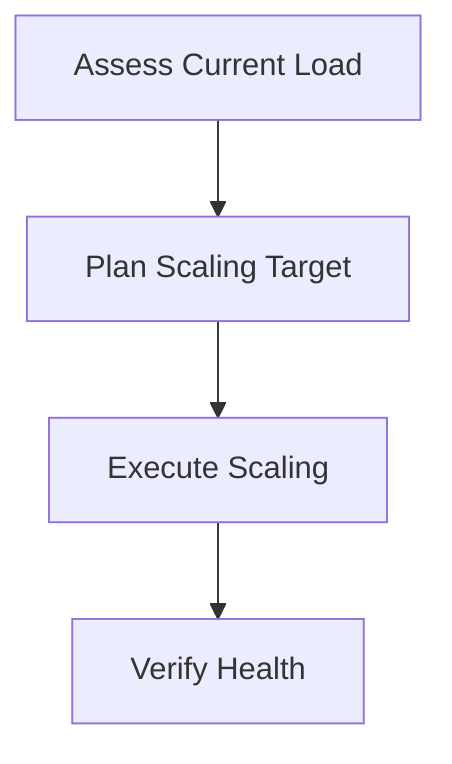

# NetBird Scaling Runbook

Complete scaling procedures for NetBird Helm deployment on Kubernetes.

## Overview



### Scaling Dimensions

| Component | Scaling Type | Method | Considerations |
|-----------|--------------|--------|----------------|
| **Management** | Horizontal | Replicas | Database connection pooling |
| **Signal** | Horizontal | Replicas | Stateless, easy to scale |
| **Dashboard** | Horizontal | Replicas | Stateless, easy to scale |
| **Relay** | Horizontal | Replicas | Network bandwidth |
| **Database** | Vertical | Resources | Requires restart |

---

## Assessment

### Current Load Assessment

**Check current resource usage:**
```bash
# Pod resource usage
kubectl top pods -n netbird

# Node resource usage
kubectl top nodes

# Detailed metrics
kubectl get --raw /apis/metrics.k8s.io/v1beta1/namespaces/netbird/pods | jq
```

**Check current replica counts:**
```bash
# Get current replicas
kubectl get deployments -n netbird -o custom-columns=\
NAME:.metadata.name,\
REPLICAS:.spec.replicas,\
READY:.status.readyReplicas,\
AVAILABLE:.status.availableReplicas
```

**Check connection metrics:**
```bash
# Management API connections
kubectl exec -n netbird deployment/netbird-management -- \
  netstat -an | grep :443 | wc -l

# Signal server connections
kubectl exec -n netbird deployment/netbird-signal -- \
  netstat -an | grep :10000 | wc -l
```

### Scaling Triggers

**When to scale up:**
- CPU usage > 70% sustained
- Memory usage > 80% sustained
- Response time > 500ms
- Connection errors increasing
- Peer registration delays

**When to scale down:**
- CPU usage < 30% sustained
- Memory usage < 40% sustained
- Over-provisioned resources
- Cost optimization needed

---

## Planning

### Scaling Plan

**Scaling recommendations:**

| Current Peers | Management Replicas | Signal Replicas | Dashboard Replicas |
|---------------|---------------------|-----------------|-------------------|
| < 100 | 1 | 1 | 1 |
| 100-500 | 2 | 2 | 2 |
| 500-1000 | 3 | 3 | 2 |
| 1000-5000 | 5 | 5 | 3 |
| 5000+ | 7+ | 7+ | 3 |

**Resource recommendations:**

| Component | CPU Request | CPU Limit | Memory Request | Memory Limit |
|-----------|-------------|-----------|----------------|--------------|
| Management | 500m | 2000m | 512Mi | 2Gi |
| Signal | 250m | 1000m | 256Mi | 1Gi |
| Dashboard | 100m | 500m | 128Mi | 512Mi |
| Relay | 500m | 2000m | 512Mi | 2Gi |

---

## Scaling Execution

### Horizontal Scaling

#### Scale Management Service

**Using kubectl:**
```bash
# Scale up
kubectl scale deployment/netbird-management -n netbird --replicas=3

# Verify scaling
kubectl get pods -n netbird -l app=netbird-management -w
```

**Using Helm:**
```bash
# Update values
helm upgrade netbird netbird/netbird \
  --namespace netbird \
  --reuse-values \
  --set management.replicas=3 \
  --wait

# Or update terraform.tfvars
cd infrastructure/helm-stack
# Edit terraform.tfvars: replica_count = 3
terraform apply
```

#### Scale Signal Service

**Scale signal servers:**
```bash
# Using kubectl
kubectl scale deployment/netbird-signal -n netbird --replicas=3

# Using Helm
helm upgrade netbird netbird/netbird \
  --namespace netbird \
  --reuse-values \
  --set signal.replicas=3 \
  --wait
```

#### Scale Dashboard

**Scale dashboard:**
```bash
# Using kubectl
kubectl scale deployment/netbird-dashboard -n netbird --replicas=2

# Using Helm
helm upgrade netbird netbird/netbird \
  --namespace netbird \
  --reuse-values \
  --set dashboard.replicas=2 \
  --wait
```

### Vertical Scaling

#### Increase Resource Limits

**Update resource limits:**
```bash
# Using Helm
helm upgrade netbird netbird/netbird \
  --namespace netbird \
  --reuse-values \
  --set management.resources.requests.cpu=1000m \
  --set management.resources.requests.memory=1Gi \
  --set management.resources.limits.cpu=2000m \
  --set management.resources.limits.memory=2Gi \
  --wait
```

**Update via Terraform:**
```hcl
# In terraform.tfvars or variables
management_resources = {
  requests = {
    cpu    = "1000m"
    memory = "1Gi"
  }
  limits = {
    cpu    = "2000m"
    memory = "2Gi"
  }
}
```

### Database Scaling

#### PostgreSQL Scaling

**Vertical scaling (increase resources):**
```bash
# Update PostgreSQL resources
kubectl edit statefulset/postgresql -n netbird

# Or using Helm
helm upgrade postgresql bitnami/postgresql \
  --namespace netbird \
  --reuse-values \
  --set primary.resources.requests.memory=2Gi \
  --set primary.resources.requests.cpu=1000m \
  --wait
```

**Connection pooling (PgBouncer):**
```yaml
# Deploy PgBouncer for connection pooling
apiVersion: apps/v1
kind: Deployment
metadata:
  name: pgbouncer
  namespace: netbird
spec:
  replicas: 2
  selector:
    matchLabels:
      app: pgbouncer
  template:
    metadata:
      labels:
        app: pgbouncer
    spec:
      containers:
      - name: pgbouncer
        image: pgbouncer/pgbouncer:latest
        ports:
        - containerPort: 5432
        env:
        - name: DATABASES_HOST
          value: postgresql.netbird.svc.cluster.local
        - name: DATABASES_PORT
          value: "5432"
        - name: DATABASES_DBNAME
          value: netbird
        - name: PGBOUNCER_POOL_MODE
          value: transaction
        - name: PGBOUNCER_MAX_CLIENT_CONN
          value: "1000"
        - name: PGBOUNCER_DEFAULT_POOL_SIZE
          value: "25"
```

---

## Auto-Scaling

### Horizontal Pod Autoscaler (HPA)

**Create HPA for Management:**
```yaml
apiVersion: autoscaling/v2
kind: HorizontalPodAutoscaler
metadata:
  name: netbird-management-hpa
  namespace: netbird
spec:
  scaleTargetRef:
    apiVersion: apps/v1
    kind: Deployment
    name: netbird-management
  minReplicas: 2
  maxReplicas: 10
  metrics:
  - type: Resource
    resource:
      name: cpu
      target:
        type: Utilization
        averageUtilization: 70
  - type: Resource
    resource:
      name: memory
      target:
        type: Utilization
        averageUtilization: 80
  behavior:
    scaleDown:
      stabilizationWindowSeconds: 300
      policies:
      - type: Percent
        value: 50
        periodSeconds: 60
    scaleUp:
      stabilizationWindowSeconds: 60
      policies:
      - type: Percent
        value: 100
        periodSeconds: 60
```

**Apply HPA:**
```bash
kubectl apply -f netbird-management-hpa.yaml

# Monitor HPA
kubectl get hpa -n netbird -w
```

**Create HPA for Signal:**
```yaml
apiVersion: autoscaling/v2
kind: HorizontalPodAutoscaler
metadata:
  name: netbird-signal-hpa
  namespace: netbird
spec:
  scaleTargetRef:
    apiVersion: apps/v1
    kind: Deployment
    name: netbird-signal
  minReplicas: 2
  maxReplicas: 10
  metrics:
  - type: Resource
    resource:
      name: cpu
      target:
        type: Utilization
        averageUtilization: 70
```

### Cluster Autoscaler

**Enable cluster autoscaler (AWS EKS example):**
```bash
# Install cluster autoscaler
kubectl apply -f https://raw.githubusercontent.com/kubernetes/autoscaler/master/cluster-autoscaler/cloudprovider/aws/examples/cluster-autoscaler-autodiscover.yaml

# Configure for your cluster
kubectl -n kube-system edit deployment cluster-autoscaler

# Add cluster name
--node-group-auto-discovery=asg:tag=k8s.io/cluster-autoscaler/enabled,k8s.io/cluster-autoscaler/<YOUR-CLUSTER-NAME>
```

---

## Verification

### Post-Scaling Verification

**Check pod status:**
```bash
# All pods should be Running
kubectl get pods -n netbird

# Check pod distribution across nodes
kubectl get pods -n netbird -o wide
```

**Check resource usage:**
```bash
# Pod metrics
kubectl top pods -n netbird

# Node metrics
kubectl top nodes
```

**Check service endpoints:**
```bash
# Management endpoints
kubectl get endpoints -n netbird netbird-management

# Signal endpoints
kubectl get endpoints -n netbird netbird-signal
```

**Functional tests:**
```bash
# Test management API
kubectl exec -n netbird deployment/netbird-management -- \
  curl -sk https://localhost:443/api/status

# Test signal server
kubectl exec -n netbird deployment/netbird-signal -- \
  curl -sk https://localhost:10000/health

# Test dashboard
kubectl port-forward -n netbird svc/netbird-dashboard 8080:80
curl http://localhost:8080
```

**Load testing:**
```bash
# Install k6 for load testing
kubectl run k6 --image=grafana/k6 --rm -it --restart=Never -- \
  run - <<EOF
import http from 'k6/http';
import { check } from 'k6';

export let options = {
  stages: [
    { duration: '2m', target: 100 },
    { duration: '5m', target: 100 },
    { duration: '2m', target: 0 },
  ],
};

export default function () {
  let res = http.get('https://netbird.example.com/api/status');
  check(res, { 'status was 200': (r) => r.status == 200 });
}
EOF
```

---

## Scaling Down

### Scale Down Procedure

**Gradual scale down:**
```bash
# Scale down management (one at a time)
kubectl scale deployment/netbird-management -n netbird --replicas=2

# Wait and monitor
sleep 60
kubectl top pods -n netbird

# Continue scaling down if metrics are good
kubectl scale deployment/netbird-management -n netbird --replicas=1
```

**Drain specific pods:**
```bash
# Cordon node (prevent new pods)
kubectl cordon <node-name>

# Drain node (evict pods gracefully)
kubectl drain <node-name> --ignore-daemonsets --delete-emptydir-data

# Uncordon when done
kubectl uncordon <node-name>
```

---

## Troubleshooting

### Scaling Issues

| Issue | Cause | Solution |
|-------|-------|----------|
| Pods stuck Pending | Insufficient resources | Add nodes or reduce requests |
| Pods CrashLoopBackOff | Resource limits too low | Increase limits |
| Uneven load distribution | No load balancer | Check service configuration |
| Database connection errors | Too many connections | Implement connection pooling |
| Slow response times | Insufficient replicas | Scale up further |

**Debug commands:**
```bash
# Check pod events
kubectl describe pod <pod-name> -n netbird

# Check HPA status
kubectl describe hpa -n netbird

# Check node capacity
kubectl describe nodes | grep -A 5 "Allocated resources"
```

### Performance Issues

**Check bottlenecks:**
```bash
# Database connections
kubectl exec -n netbird deployment/netbird-management -- \
  psql -h $DB_HOST -U $DB_USER -d $DB_NAME \
  -c "SELECT count(*) FROM pg_stat_activity;"

# Network latency
kubectl exec -n netbird deployment/netbird-management -- \
  ping -c 5 netbird-signal.netbird.svc.cluster.local
```

---

## Related Documentation

| Document | Description |
|----------|-------------|
| [Deployment Runbook](deployment.md) | Fresh deployment |
| [Upgrade Runbook](upgrade.md) | Upgrade procedures |
| [Troubleshooting](troubleshooting.md) | Common issues |
| [Operations Book](../../operations-book/helm-stack/README.md) | Operations guide |

## Revision History

| Date | Version | Author | Changes |
|------|---------|--------|---------|
| 2024-02 | 1.0 | Platform Team | Initial version |
