# Tutorial: Secure AWS VPC Access with NetBird

This tutorial guides you through configuring NetBird to provide secure remote access to resources within an AWS VPC. We will use a "Gateway Peer" to route traffic from the NetBird network to your private AWS subnet.

## Prerequisites

*   An active NetBird account.
*   An AWS VPC with at least one private subnet.
*   An EC2 instance in that VPC to serve as the NetBird Gateway.

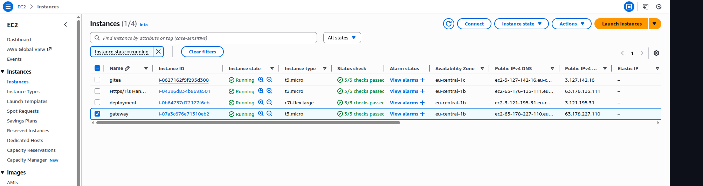

## Step 1: AWS Infrastructure Configuration

Before configuring NetBird, ensure your AWS environment allows traffic to flow through the Gateway.

### 1.1. Security Group Setup

The resources you want to access must permit inbound traffic from the NetBird Gateway.

1.  Identify the Security Group assigned to your private resources.
2.  Add an **Inbound Rule** to allow traffic from the **Private IP of the NetBird Gateway** or its assigned Security Group.

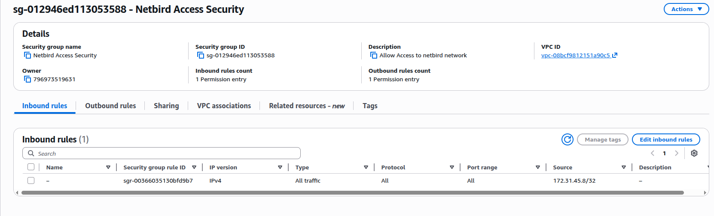

> [!NOTE]
> Restricting access to the Gateway's private IP ensures that only traffic routed through your secure NetBird tunnel can reach these internal resources.

### 1.2. VPC Routing Table

The VPC must know how to send return traffic back to the NetBird network.

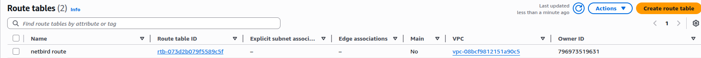

Confirm that your subnet's routing table includes:
1.  A **Local Route** for the VPC CIDR (this allows internal resources to reach the Gateway peer).
2.  A **Return Route** for the NetBird network (e.g., `100.64.0.0/10`) with the **Gateway Instance ID** as the target.

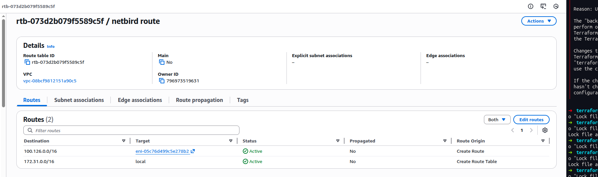

> [!IMPORTANT]
> The return route is critical. Without it, VPC resources won't know that traffic for NetBird peers should be sent to the Gateway EC2 instance. Ensure the **Target** is the specific Instance ID of your Gateway.

### 1.3. Disable Source/Destination Check

By default, AWS EC2 instances only accept traffic destined for them. Since the Gateway forwards traffic to other resources, you **must** disable this check.

1.  In the EC2 Console, select your Gateway instance.
2.  Navigate to **Actions > Networking > Change source/destination check**.
3.  Set it to **Stop**.

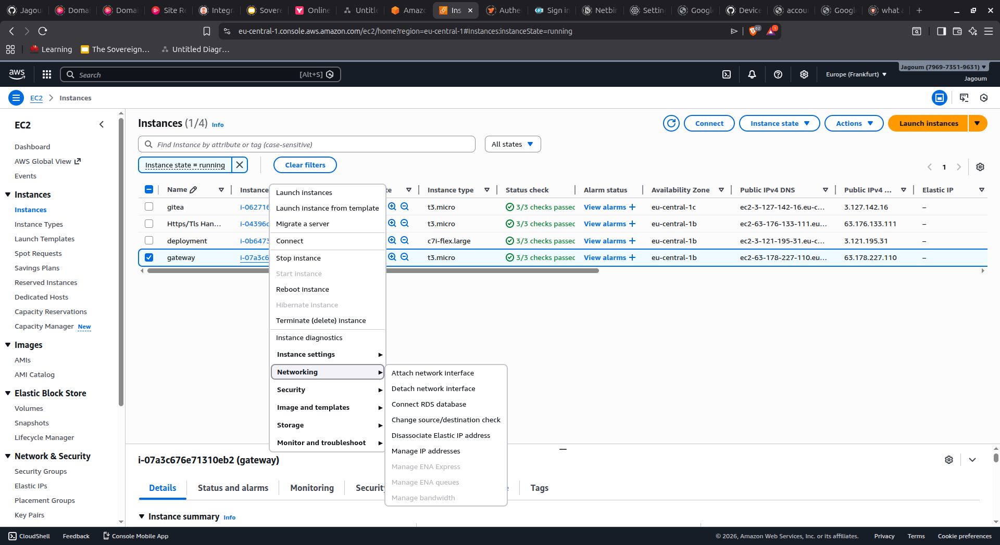
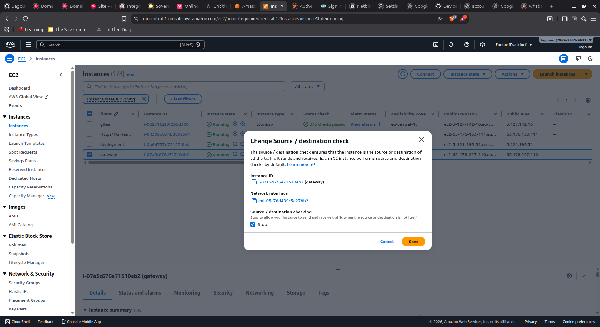

## Step 2: Verify Peer Connectivity

Log in to the [NetBird Dashboard](https://app.netbird.io/) and ensure your Gateway and client peers are active.

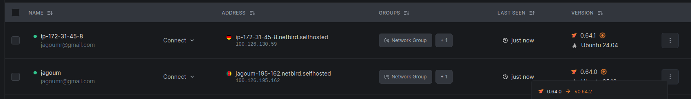

Checking the status here ensures that the NetBird encrypted tunnel is established between your devices before you attempt to configure complex routing.

## Step 3: Configure Routing Peer

1.  Go to the **Network Routes** section in the NetBird Dashboard.
2.  Click **Add Route**.
3.  **Network Range**: Enter your VPC CIDR (e.g., `172.31.0.0/20`).
4.  **Routing Peer**: Select your Gateway instance or a **Peer Group** containing it.

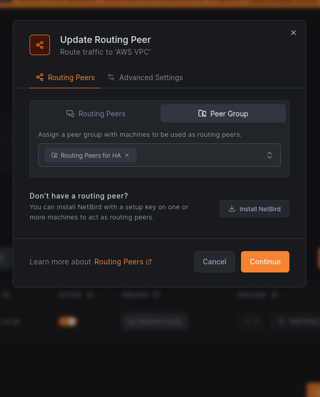

5.  Click **Save**. You should now see the route listed in your Network Routes overview.

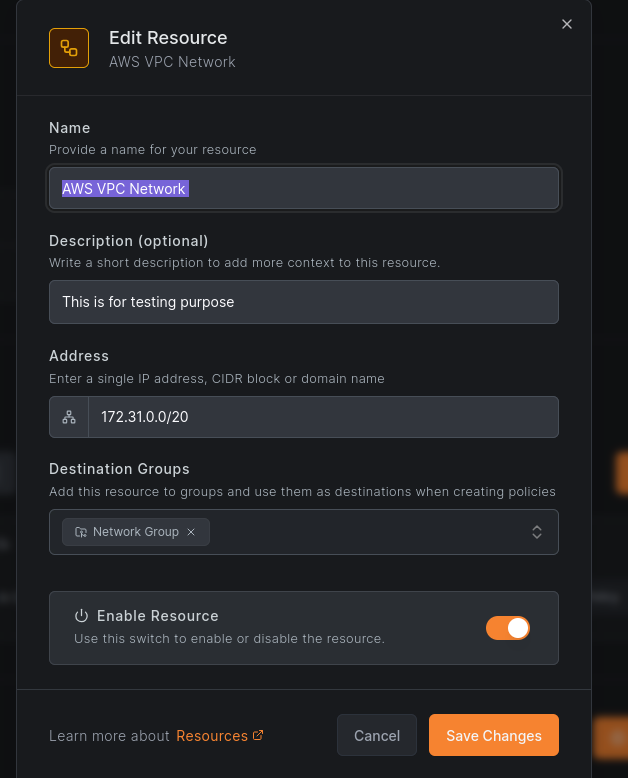

### Advanced Settings: Masquerade

In the **Advanced Settings** tab, ensure **Masquerade** is enabled.

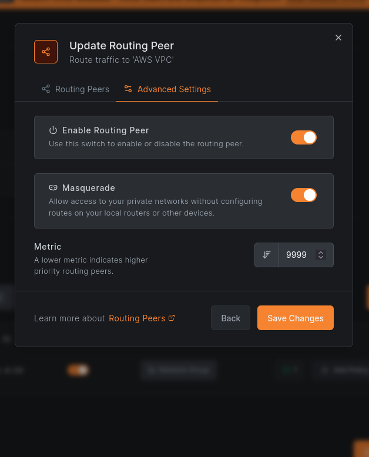

> [!IMPORTANT]
> Enabling **Masquerade** allows the Gateway to "hide" the NetBird IP addresses behind its own AWS private IP. This eliminates the need to update routing tables on every single destination resource in your VPC.

## Step 4: Fine-Grained Access Control (Resources)

Instead of broad network access, you can define specific **Resources** to apply granular policies.

1.  Go to **Networks > Resources**.
2.  Define your AWS VPC Network.
3.  Assign it to a **Network Group** for policy enforcement.

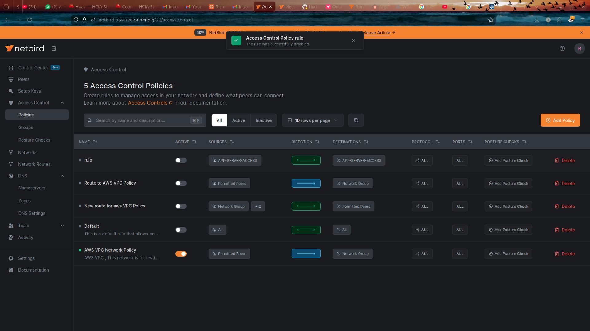

This abstraction allows you to create Access Control policies that specifically target these resources, ensuring only authorized users or groups can reach the VPC.

## Step 5: Verification

To verify the setup, attempt to reach a private resource from a NetBird-connected client.

1.  On your local machine, ensure NetBird is up: `netbird status`.
2.  Ping a private IP in your AWS VPC.

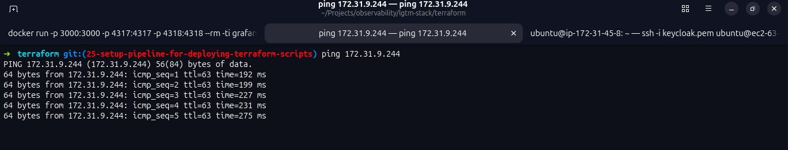

A successful ping confirms that:
*   The NetBird tunnel is active.
*   The Routing Peer is correctly forwarding traffic.
*   AWS Security Groups and Source/Destination checks are correctly configured.

---

> [!TIP]
> If you cannot reach your resources, double-check the **Metric** in Advanced Settings. A lower metric indicates a higher priority for that routing peer.
