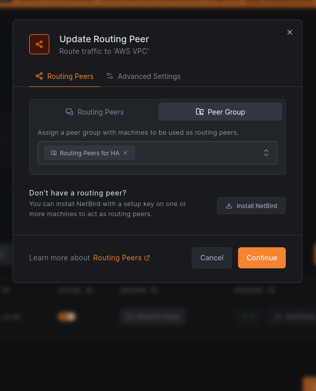
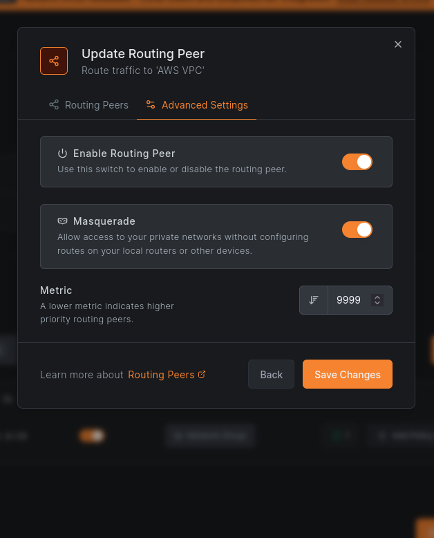
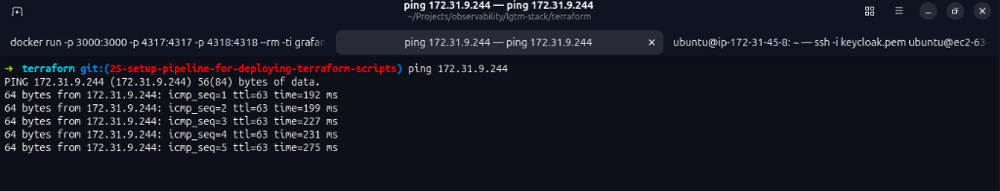
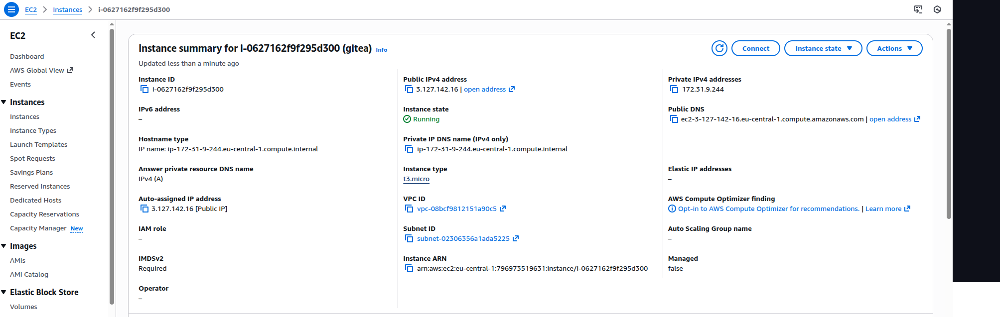
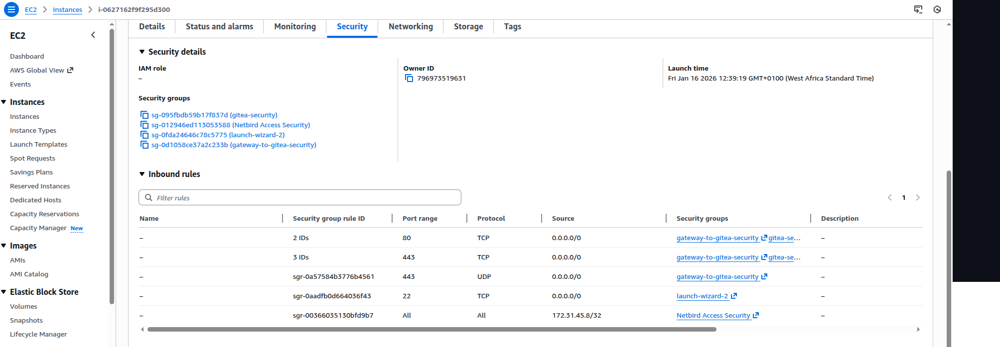
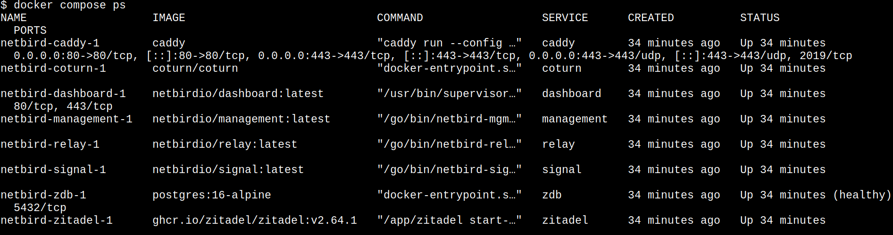
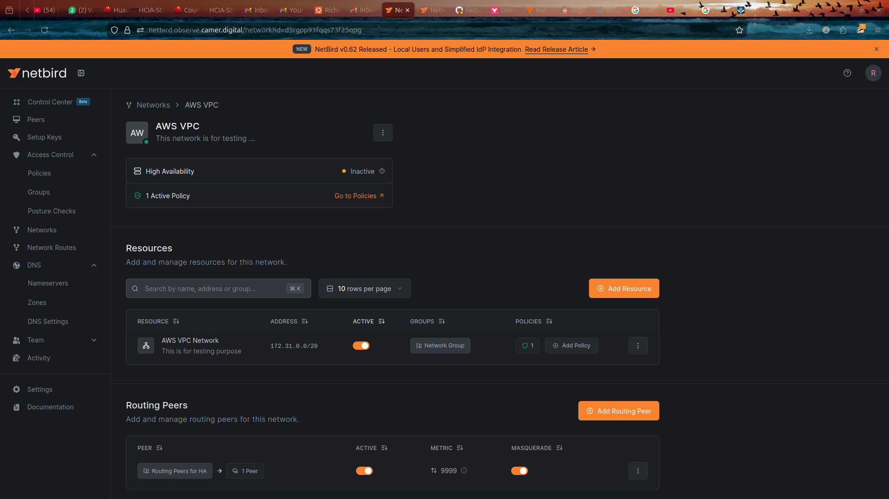
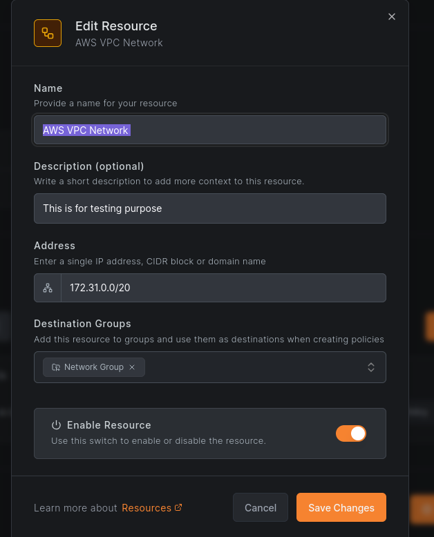

# NetBird Use Cases

Discover practical deployment scenarios for NetBird, from simple remote access to complex multi-cloud mesh networks.

## Overview

NetBird is a WireGuard-based mesh VPN that enables secure connectivity between devices, servers, and networks using zero-trust principles. This guide covers common deployment scenarios with step-by-step instructions.

<details open>
<summary>Table Of Content</summary>

### Remote Access
- [Use Case 1: Point-to-Site VPN (Remote Access)](#use-case-1-point-to-site-vpn-remote-access)
- [Use Case 3: Secure Application Access](#use-case-3-secure-application-access)
- [Use Case 6: Kubernetes Cluster Access](#use-case-6-kubernetes-cluster-access)

### Network Connectivity
- [Use Case 2: Site-to-Site VPN (Network Routes)](#use-case-2-site-to-site-vpn-network-routes)
- [Use Case 5: Multi-Cloud Connectivity](#use-case-5-multi-cloud-connectivity)

### Cloud Integration
- [Use Case 4: AWS VPC Integration](#use-case-4-aws-vpc-integration)

</details>

---

## Use Case 1: Point-to-Site VPN (Remote Access)

<details>
<summary>Connect remote users securely to your infrastructure</summary>

### Scenario
Remote employees need access to internal services without exposing them to the internet.

### Architecture Diagram
```
┌──────────────────────────────────────────────────────────────┐
│              POINT-TO-SITE VPN ARCHITECTURE                  │
└──────────────────────────────────────────────────────────────┘

[Remote Laptop] ──┐
                  │
[Remote Desktop] ─┼──► NetBird Mesh ──► [Internal Services]
                  │                      ├─ Databases
[Mobile Device] ──┘                      ├─ APIs
                                         └─ Admin Panels

Features:
• No VPN client configuration needed
• Automatic peer discovery
• Works behind NAT/firewalls
• Fine-grained access control
• End-to-end encryption
```

### Benefits
- No public IPs or firewall rules required
- Zero-trust access control with SSO and MFA
- Automatic peer discovery and connection
- Works behind NAT/firewalls
- Fine-grained access control via groups and policies
- End-to-end encryption

### Setup Steps

<details>
<summary>Step-by-Step Configuration</summary>

1. **Deploy NetBird Infrastructure**
   - [Ansible Stack Deployment](./runbooks/ansible-stack/deployment.md)
   - [Helm Stack Deployment](./runbooks/helm-stack/deployment.md)

2. **Install NetBird Client on User Devices**
   ```bash
   # Linux/macOS
   curl -fsSL https://pkgs.netbird.io/install.sh | sh
   
   # Windows
   # Download from https://netbird.io/downloads
   ```

3. **Create Setup Keys in NetBird Dashboard**
   
   Setup keys are pre-authentication tokens that allow devices to connect to your NetBird network without interactive SSO login. They're particularly useful for servers, containers, and headless devices.
   
   - Navigate to **Setup Keys** → **Add Key**
   - Set expiration and usage limits
   - Assign to appropriate groups (devices using this key will automatically join these groups)

4. **Configure Access Control**
   - Create groups for users and resources
   - Define access policies
   - Enable MFA if required

5. **Users Connect via SSO**
   ```bash
   netbird up --setup-key <your-setup-key>
   ```

</details>

### Use Cases
- Remote employee access to corporate resources
- Contractor access to specific services
- Mobile device access to internal tools
- Home office connectivity

</details>

---

## Use Case 2: Site-to-Site VPN (Network Routes)

<details>
<summary>Connect multiple office locations or data centers</summary>

> **Note:** NetBird now offers a newer "Networks" feature that provides simpler setup for many use cases. However, "Network Routes" (described here) continues to be maintained and is required for advanced scenarios like Site-to-Site connectivity, masquerade control, and ACL Groups. For simple VPN-to-Site access (NetBird peers accessing internal resources), consider using the Networks feature instead.

### Scenario
Multiple office locations, data centers, or cloud VPCs need to communicate without installing NetBird on every device.

### Architecture Diagram
```
┌──────────────────────────────────────────────────────────────┐
│              SITE-TO-SITE VPN ARCHITECTURE                   │
└──────────────────────────────────────────────────────────────┘

[Office A Network]          NetBird Mesh          [Office B Network]
  10.0.1.0/24                                        10.0.2.0/24
       │                                                  │
       │                                                  │
  [Routing Peer A] ◄────── Encrypted Tunnel ──────► [Routing Peer B]
       │                                                  │
       │                                                  │
  ┌────┴────┐                                        ┌────┴────┐
  │ Devices │                                        │ Devices │
  │ Servers │                                        │ Servers │
  │   NAS   │                                        │   NAS   │
  └─────────┘                                        └─────────┘

Traffic Flow:
Device A (10.0.1.10) → Routing Peer A → NetBird Mesh → 
Routing Peer B → Device B (10.0.2.20)
```

### Key Concepts

<details>
<summary>Understanding Routing Peers and Network Routes</summary>

**Routing Peer**: A NetBird device that forwards traffic between the NetBird mesh and private networks.

**Network Routes**: Define which networks are accessible through routing peers.

**Masquerade Modes**:
- **Enabled (default)**: NAT mode - simplifies setup, hides source IPs
- **Disabled**: Preserves source IPs for auditing, requires manual routing

> **Important:** If you disable masquerade, you CANNOT use ACL Groups or Network Resources. Masquerade must be enabled for these features to work properly.

**High Availability**: Deploy multiple routing peers for redundancy.

</details>

### Setup Steps

<details>
<summary>Step-by-Step Configuration</summary>

#### 1. Install NetBird on Routing Peers

```bash
# On each routing peer (Linux/Windows/macOS)
curl -fsSL https://pkgs.netbird.io/install.sh | sh
netbird up --setup-key <your-setup-key>
```

#### 2. Enable IP Forwarding

```bash
# Linux
echo "net.ipv4.ip_forward=1" >> /etc/sysctl.conf
sysctl -p

# Verify
sysctl net.ipv4.ip_forward
```

#### 3. Create Network Route in NetBird Dashboard

- Navigate to **Network Routes** → **Add Route**
- **Network Identifier**: `office-a-network`
- **Network Range**: `10.0.1.0/24`
- **Routing Peer**: Select your routing peer
- **Distribution Groups**: Select groups that should access this network
- **Masquerade**: Enabled (recommended)
- Click **Add Route**





#### 4. Configure High Availability (Optional)

- Add multiple routing peers for the same network
- Use **Peer Groups** for automatic failover
- Set **Metric** values (lower = higher priority)

#### 5. Test Connectivity

```bash
# From NetBird client
ping 10.0.1.10  # Device in Office A network
ssh user@10.0.1.10  # SSH to device in Office A
```



</details>

### Security Considerations

<details>
<summary>Important: Access Control Behavior with Network Routes</summary>

**Critical:** Network Routes behave differently from standard peer-to-peer access control:

- Network Routes only require connectivity to the Routing Peer to function
- Access Control policies between source peers and the routing peer are evaluated
- However, once traffic reaches the routing peer, it can access ANY resource in the routed network
- This means you cannot use Access Control policies to restrict access to specific IPs within a routed network

**Example of Unexpected Behavior:**
If you create a policy allowing only ICMP (ping) from Group A to the Routing Peer, users in Group A will still be able to access ALL services (HTTP, SSH, etc.) in the routed network, not just ICMP.

**Best Practice:**
- Use the newer "Networks" feature with Network Resources for granular per-resource access control
- If using Network Routes, implement additional security controls at the network level (firewalls, security groups)
- Consider Network Routes as providing network-level access, not resource-level access

</details>

### Use Cases
- Connect branch offices to headquarters
- Link multiple data centers
- Hybrid cloud connectivity
- Disaster recovery site connectivity

</details>

---

## Use Case 3: Secure Application Access

<details>
<summary>Zero-trust access to internal applications</summary>

### Scenario
Provide secure access to internal applications without exposing them to the internet.

### Architecture Diagram
```
┌──────────────────────────────────────────────────────────────┐
│           SECURE APPLICATION ACCESS ARCHITECTURE             │
└──────────────────────────────────────────────────────────────┘

[User Device] ──► NetBird Mesh ──► [Application Server]
                                    • No public IP
                                    • No firewall rules
                                    • Zero-trust access

Access Control Flow:
User → SSO/MFA → NetBird Auth → Policy Check → Application
```

### Access Control Example

<details>
<summary>Group and Policy Configuration</summary>

#### 1. Create Groups

In the NetBird Dashboard, navigate to **Peers > Groups** and create the following groups:


**Understanding Groups:**

NetBird uses groups to organize peers (devices) for access control. While NetBird treats all groups the same technically, it's helpful to think of two types:

- **User Groups:** Assigned to user accounts and inherited by their devices (laptops, phones). Often synced from your Identity Provider (IdP).
- **Peer Groups:** Assigned directly to infrastructure (servers, databases) via setup keys or manual assignment.

**Best Practice:** Use user groups as Source and peer groups as Destination in policies. For example:
- ✅ `developers` (users) → `database-servers` (infrastructure)
- ❌ Avoid mixing users and infrastructure in the same group

```
Groups:
├─ developers (Development team - User Group)
├─ database-servers (PostgreSQL/MySQL servers - Peer Group)
└─ web-servers (Internal web applications - Peer Group)
```


#### 2. Create Access Policies

```yaml
Policy: Database Access
  Source: developers
  Destination: database-servers
  Protocol: TCP
  Ports: 5432 (PostgreSQL), 3306 (MySQL)
  Action: Allow

Policy: Web Access
  Source: developers
  Destination: web-servers
  Protocol: TCP
  Ports: 80, 443
  Action: Allow

Policy: SSH Access
  Source: developers
  Destination: database-servers, web-servers
  Protocol: TCP
  Ports: 22
  Action: Allow
```

#### 3. Assign Peers to Groups

- Add application servers to appropriate groups
- Add user devices to `developers` group

</details>

### Benefits
- No firewall configuration needed
- Granular access control per protocol/port
- Complete audit trail
- MFA enforcement via SSO
- Automatic encryption

### DNS Configuration (Optional)

<details>
<summary>Configure DNS zones for easy access to internal applications</summary>

Instead of using IP addresses, you can configure DNS zones in NetBird to access applications using friendly names.

#### 1. Navigate to DNS Zones


#### 2. Add DNS Records

Create DNS records for your internal applications:


**Example DNS Records:**
```
app.internal → 10.0.1.10
db.internal → 10.0.1.20
admin.internal → 10.0.1.30
```

#### 3. Access Applications by Name

```bash
# Instead of: ssh user@10.0.1.10
ssh user@app.internal

# Instead of: psql -h 10.0.1.20
psql -h db.internal

# Instead of: curl http://10.0.1.30
curl http://admin.internal
```

</details>

### Use Cases
- Internal web applications (admin panels, monitoring)
- Database access for developers
- SSH access to servers
- API access for internal tools

</details>

---

## Use Case 4: AWS VPC Integration

<details>
<summary>Secure access to AWS VPC resources without public endpoints</summary>

### Overview

Traditional VPN solutions require complex infrastructure, expose ports to the internet, and create performance bottlenecks. This guide shows you how to use NetBird to provide secure, peer-to-peer access to AWS VPC resources without a central gateway bottleneck.

**You'll learn how to:**
- Configure a NetBird Gateway Peer within your AWS VPC
- Set up secure routing without exposing services publicly
- Apply fine-grained access control policies
- Verify connectivity to private resources

### Architecture Diagram
```
┌──────────────────────────────────────────────────────────────┐
│              AWS VPC INTEGRATION ARCHITECTURE                │
└──────────────────────────────────────────────────────────────┘

[NetBird Clients] ──► NetBird Mesh ──► [EC2 Routing Peer] ──► [AWS VPC]
                                              │                    │
                                              │                    ├─ Private EC2
                                              │                    ├─ RDS
                                              │                    └─ ElastiCache
                                              │
                                        [Public Subnet]
                                        Source/Dest Check: Disabled

VPC Route Table:
Destination: 100.64.0.0/10 (NetBird)
Target: eni-xxx (Routing Peer ENI)
```

### Prerequisites

<details>
<summary>Requirements</summary>

- An active NetBird account
- An AWS VPC with at least one private subnet
- An EC2 instance in that VPC to serve as the NetBird Gateway


</details>

### Step 1: AWS Infrastructure Configuration

<details>
<summary>Configure AWS environment for NetBird traffic</summary>

Before configuring NetBird, ensure your AWS environment allows traffic to flow through the Gateway.

#### 1.1. Security Group Setup

The resources you want to access must permit inbound traffic from the NetBird Gateway.

1. Identify the Security Group assigned to your private resources



2. Add an **Inbound Rule** to allow traffic from the **Private IP of the NetBird Gateway** or its assigned Security Group


3. Verify the security configuration on your target resources



> **Note**: Restricting access to the Gateway's private IP ensures that only traffic routed through your secure NetBird tunnel can reach these internal resources.

#### 1.2. VPC Routing Table

The VPC must know how to send return traffic back to the NetBird network.


Confirm that your subnet's routing table includes:

1. A **Local Route** for the VPC CIDR (this allows internal resources to reach the Gateway peer)
2. A **Return Route** for the NetBird network (e.g., `100.64.0.0/10`) with the **Gateway Instance ID** as the target


> **Important**: The return route is critical. Without it, VPC resources won't know that traffic for NetBird peers should be sent to the Gateway EC2 instance. Ensure the **Target** is the specific Instance ID of your Gateway.

#### 1.3. Disable Source/Destination Check

By default, AWS EC2 instances only accept traffic destined for them. Since the Gateway forwards traffic to other resources, you **must** disable this check.

1. In the EC2 Console, select your Gateway instance
2. Navigate to **Actions > Networking > Change source/destination check**
3. Set it to **Stop**


</details>

### Step 2: Verify Peer Connectivity

<details>
<summary>Ensure NetBird tunnel is established</summary>

#### Check NetBird Service Status

On your Gateway instance, verify the NetBird service is running:

```bash
sudo systemctl status netbird
# or check Docker containers if using containerized deployment
docker ps
```



#### Verify Dashboard Connectivity

Log in to the NetBird Dashboard and ensure your Gateway and client peers are active.


Checking the status here ensures that the NetBird encrypted tunnel is established between your devices before you attempt to configure complex routing.

</details>

### Step 3: Configure Routing Peer

<details>
<summary>Set up network routes in NetBird</summary>

1. Go to the **Network Routes** section in the NetBird Dashboard
2. Click **Add Route**
3. **Network Range**: Enter your VPC CIDR (e.g., `172.31.0.0/20`)
4. **Routing Peer**: Select your Gateway instance or a **Peer Group** containing it


5. Click **Save**. You should now see the route listed in your Network Routes overview


#### Advanced Settings: Masquerade

In the **Advanced Settings** tab, ensure **Masquerade** is enabled.


> **Important**: Enabling **Masquerade** allows the Gateway to "hide" the NetBird IP addresses behind its own AWS private IP. This eliminates the need to update routing tables on every single destination resource in your VPC.

</details>

### Step 4: Fine-Grained Access Control

<details>
<summary>Define specific resources for granular policies</summary>

Instead of broad network access, you can define specific **Resources** to apply granular policies.

1. Go to **Networks > Resources**



2. Define your AWS VPC Network



3. Assign it to a **Network Group** for policy enforcement


This abstraction allows you to create Access Control policies that specifically target these resources, ensuring only authorized users or groups can reach the VPC.

</details>

### Step 5: Verification

<details>
<summary>Test connectivity to private resources</summary>

To verify the setup, attempt to reach a private resource from a NetBird-connected client.

1. On your local machine, ensure NetBird is up: `netbird status`
2. Ping a private IP in your AWS VPC


A successful ping confirms that:
- The NetBird tunnel is active
- The Routing Peer is correctly forwarding traffic
- AWS Security Groups and Source/Destination checks are correctly configured

</details>

### Troubleshooting

<details>
<summary>Common issues and solutions</summary>

#### Problem: Cannot ping private resources

**Check 1: NetBird Status**
```bash
netbird status
# Should show: Status: Connected
```

**Check 2: Gateway Peer Health**
- Navigate to NetBird dashboard → Peers
- Verify Gateway peer shows "Connected" status
- Check "Last Seen" is recent (< 1 minute)

**Check 3: AWS Source/Destination Check**
```bash
aws ec2 describe-instance-attribute \
  --instance-id i-xxxxx \
  --attribute sourceDestCheck
# Should return: "SourceDestCheck": {"Value": false}
```

**Check 4: Security Group Rules**
- Verify inbound rule exists on target resource
- Confirm source is Gateway's private IP or security group

**Check 5: Routing Metric**
- Lower metric = higher priority (default is 9999)
- If you have multiple routes, ensure correct priority

#### Problem: Routing peer not showing up
- Verify "Enable Routing" toggle is selected
- Check Network Routes section shows the VPC CIDR
- Restart NetBird on gateway: `sudo systemctl restart netbird`

</details>

### Additional Resources
- [AWS VPC Integration Runbook](./runbooks/helm-stack/aws-vpc-integration.md)
- [NetBird Routing Traffic Guide](https://docs.netbird.io/how-to/routing-traffic)
- [AWS VPC Security Best Practices](https://docs.aws.amazon.com/vpc/latest/userguide/security-best-practices.html)

</details>

---

## Use Case 5: Multi-Cloud Connectivity

<details>
<summary>Connect workloads across multiple cloud providers</summary>

### Scenario
Workloads in different cloud providers need to communicate without exposing traffic to the public internet.

### Architecture Diagram
```
┌──────────────────────────────────────────────────────────────┐
│            MULTI-CLOUD CONNECTIVITY ARCHITECTURE             │
└──────────────────────────────────────────────────────────────┘

[AWS VPC]                                              [GCP VPC]
10.1.0.0/16                                           10.2.0.0/16
    │                                                      │
    │                                                      │
[Routing Peer A] ◄──────── NetBird Mesh ──────────► [Routing Peer B]
    │                           │                          │
    │                           │                          │
    │                           ▼                          │
    │                   [Routing Peer C]                   │
    │                           │                          │
    │                           │                          │
    │                    [Azure VNet]                      │
    │                    10.3.0.0/16                       │
    │                                                      │
    └──────────────────────────────────────────────────────┘

Benefits:
• No cloud-specific VPN gateways
• Simplified multi-cloud networking
• Consistent security policies
• Cost-effective solution
```

### Setup Steps

<details>
<summary>Step-by-Step Configuration</summary>

1. **Deploy Routing Peers in Each Cloud**
   - AWS: EC2 instance with NetBird
   - GCP: Compute Engine instance with NetBird
   - Azure: VM with NetBird

2. **Configure Network Routes for Each VPC/VNet**
   - Create route for AWS VPC (10.1.0.0/16)
   - Create route for GCP VPC (10.2.0.0/16)
   - Create route for Azure VNet (10.3.0.0/16)

3. **Set Up High Availability**
   - Deploy multiple routing peers per cloud
   - Configure automatic failover
   - Set metric priorities

4. **Configure Access Policies**
   - Define which clouds can communicate
   - Set protocol and port restrictions
   - Enable audit logging

</details>

### Use Cases
- Database migration between clouds
- Hybrid cloud applications
- Disaster recovery across regions
- Multi-cloud workload distribution

</details>

---

## Use Case 6: Kubernetes Cluster Access

<details>
<summary>Secure kubectl access without exposing API server</summary>

### Scenario
Developers and CI/CD pipelines need secure access to Kubernetes clusters without exposing the API server publicly.

### Architecture Diagram
```
┌──────────────────────────────────────────────────────────────┐
│          KUBERNETES CLUSTER ACCESS ARCHITECTURE              │
└──────────────────────────────────────────────────────────────┘

[Developer Laptop] ──┐
                     │
[CI/CD Pipeline] ────┼──► NetBird Mesh ──► [K8s Node with NetBird]
                     │                              │
[Admin Workstation] ─┘                              │
                                                     ▼
                                            [Kubernetes Cluster]
                                            • Private API Server
                                            • No public endpoint
                                            • No bastion host

Access Flow:
kubectl → NetBird Tunnel → K8s Node → API Server (Private IP)
```

### Setup Steps

<details>
<summary>Step-by-Step Configuration</summary>

1. **Install NetBird on a Kubernetes Node**
   ```bash
   # SSH to a node with cluster access
   curl -fsSL https://pkgs.netbird.io/install.sh | sh
   netbird up --setup-key <your-setup-key>
   ```

2. **Configure kubeconfig to Use Private IP**
   ```yaml
   apiVersion: v1
   clusters:
   - cluster:
       server: https://10.0.1.10:6443  # Private IP
     name: my-cluster
   ```

3. **Developers Connect via NetBird**
   ```bash
   netbird up --setup-key <your-setup-key>
   ```

4. **Access Cluster Securely**
   ```bash
   kubectl get nodes
   kubectl get pods --all-namespaces
   ```

</details>

### Benefits
- No bastion hosts needed
- Audit trail of all access
- Fine-grained RBAC via NetBird groups
- Works with any Kubernetes distribution
- Secure CI/CD pipeline access

</details>

---

## Best Practices

<details open>
<summary>Security, Performance, and Operations Guidelines</summary>

### Network Design
- Use separate groups for different access levels (dev, staging, prod)
- Implement least-privilege access policies
- Use routing peers for site-to-site connectivity
- Enable high availability for critical routes

### Security
- **Remove the Default Policy:** NetBird creates a default "All-to-All" policy for ease of onboarding. This policy allows all peers to communicate and should be removed once you've configured proper access control policies
- Enable MFA in your identity provider (Keycloak/Zitadel)
- Regularly rotate setup keys
- Monitor activity logs for suspicious access
- Use protocol and port restrictions in policies
- Implement posture checks for device compliance

### Performance
- Deploy relay servers in strategic locations for better connectivity
- Use routing peers for high-bandwidth connections
- Monitor peer connection quality
- Use masquerade mode unless source IP visibility is required

### Operations
- Automate peer deployment with Ansible
- Use tags for dynamic grouping
- Implement monitoring and alerting
- Regular backup of NetBird configuration
- Document network routes and access policies

</details>

---

## Zero Trust Principles

<details>
<summary>How NetBird Implements Zero Trust</summary>

NetBird implements zero trust networking through:

### 1. Verify Explicitly
Every connection is authenticated and authorized before access is granted.

### 2. Least Privilege
Access granted only to specific resources, not entire networks.

### 3. Assume Breach
End-to-end encryption for all traffic, regardless of network location.

### Key Features
- **Access Control Policies** - Define who can access what resources
- **Posture Checks** - Verify device compliance before granting access
- **Activity Logging** - Audit all access events
- **MFA Integration** - Enforce multi-factor authentication
- **SSO** - Integrate with identity providers

</details>

---

## Next Steps

Ready to deploy NetBird? Choose your deployment method:

- [Ansible Stack Deployment](./runbooks/ansible-stack/deployment.md) - VM-based deployment
- [Helm Stack Deployment](./runbooks/helm-stack/deployment.md) - Kubernetes deployment
- [AWS VPC Integration](./runbooks/helm-stack/aws-vpc-integration.md) - AWS-specific guide
- [Keycloak Integration](./runbooks/helm-stack/keycloak-integration.md) - SSO setup
- [Official NetBird Documentation](https://docs.netbird.io/) - Comprehensive docs
