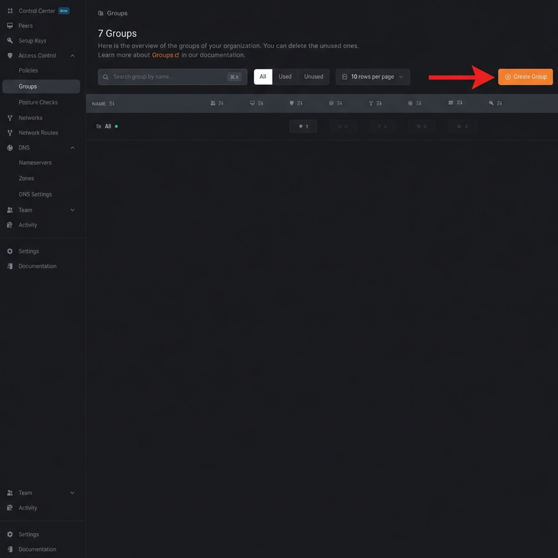
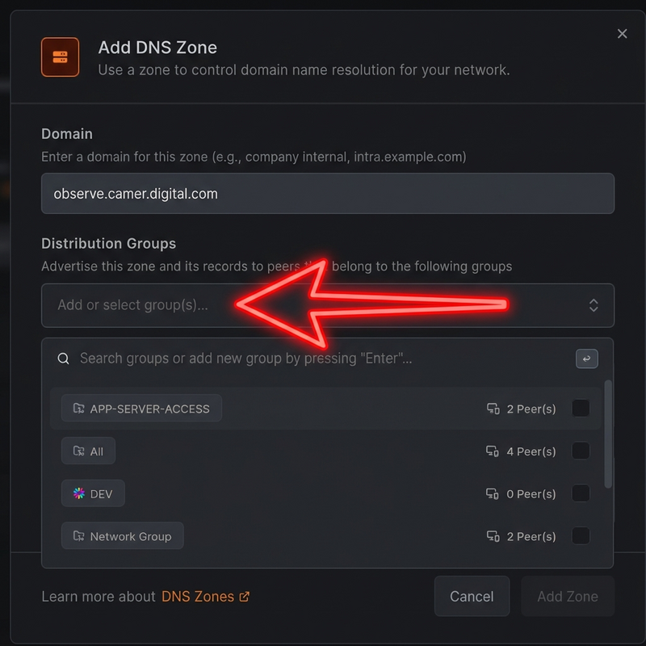
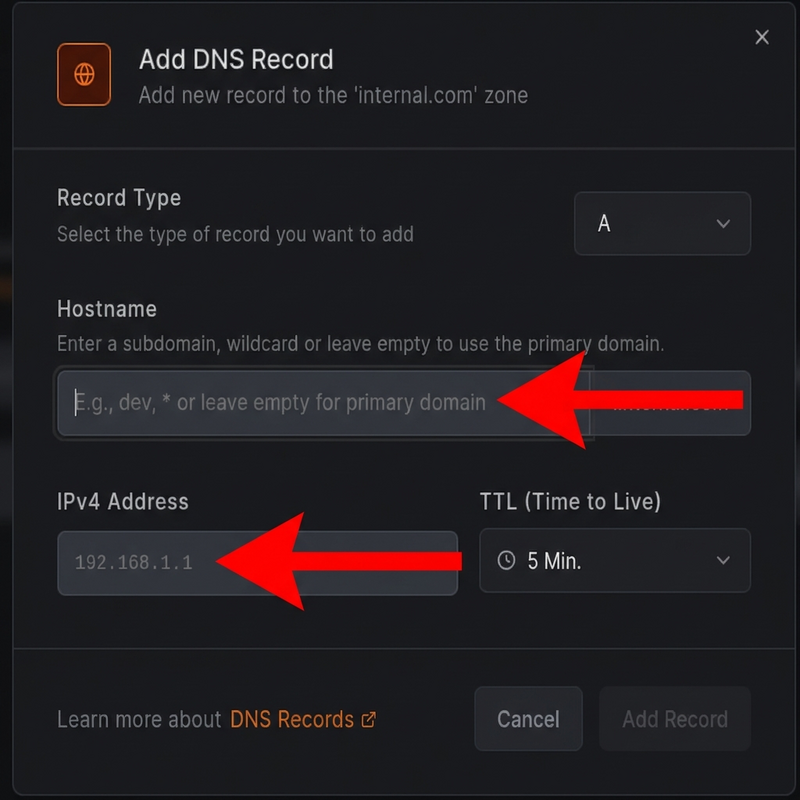

# Secure Application Access with NetBird DNS Zones

This guide explains how to securely access your applications over NetBird while keeping them invisible to the public internet using DNS Zones and Distribution Groups.

## Why Use NetBird DNS Zones Instead of Public DNS?

| Aspects | NetBird DNS Zones | Traditional DNS Provider |
|---------|-------------------|--------------------------|
| **Cost** | Free (included with NetBird) | $10-50/year per domain |
| **Privacy** | Only visible to your network | Publicly visible |
| **Management** | Centralized in NetBird dashboard | Separate DNS provider interface |
| **Access Control** | Group-based distribution | No built-in access control |
| **Setup Time** | Minutes | Hours to days (domain registration) |

---

## Prerequisites

Before you begin, ensure you have the following:

- **A NetBird Account**: You should have an active NetBird account and a network created.
- **Enrolled Client Peer**: You need at least one client device (e.g., your laptop) enrolled in your NetBird network to access the application.
- **Running Application**: An application must be running on a server that is reachable through your NetBird network (e.g., as a NetBird peer or via a routing peer).

---

## Step 1: Create Groups

Groups help you coordinate and manage who can access what in your NetBird network, creating isolation and privacy between different teams and resources.

**To create a group:**
1. Navigate to **Access Control** > **Groups**
2. Click **Create Group**
3. Name your group and assign peers (devices)

---

## Step 2: Configure DNS Zone

### Navigate to DNS Zones

### Create a Zone

1. Click **Add Zone**
2. **Domain**: Enter your private domain (e.g., `mycompany.local`)
3. **Distribution Groups**: Select which groups can resolve this domain

4. **Add DNS Record**:

5. Click **Save**

**Result**: Only users in the selected distribution groups can resolve your custom domain.

---

## Step 3: Verification

Test your configuration:

- **Authorized users** (in distribution group):
  - Run `nslookup wiki.mycompany.local` → Returns your app's IP ✅
  - Access `http://wiki.mycompany.local` → Application loads ✅

- **Unauthorized users** (not in distribution group):
  - Run `nslookup wiki.mycompany.local` → "domain not found" ❌

---

> [!IMPORTANT]
> **NetBird Network Requirement**: Client devices must be connected to NetBird with the agent installed and running. DNS resolution only works for devices in the assigned distribution group.

---

## Conclusion

By following this guide, you have successfully configured a private DNS zone within your NetBird network. This setup allows you to:

- **Enhance Security**: Expose applications only to authorized users without a public IP address.
- **Simplify Access**: Use memorable, human-readable names instead of IP addresses.
- **Improve Management**: Control access to resources centrally through NetBird's group-based policies.
