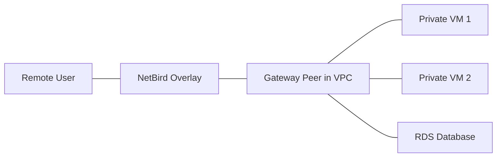

# NetBird Use Cases Overview

NetBird is a high-performance overlay network built on WireGuard® that simplifies secure connectivity between people, devices, and networks. This document explores the primary use cases for NetBird and how it can transform your infrastructure security.

## 1. Secure Remote Access (VPN Replacement)

NetBird provides a modern, peer-to-peer alternative to traditional client-to-site VPNs. Remote employees can securely access internal corporate resources without the bottleneck of a central VPN gateway.

*   **Benefit**: Improved performance due to direct peer-to-peer connections.
*   **Security**: Integrated with Identity Providers (SSO) and enforced by granular access policies.
*   **User Experience**: Simple "one-click" connection for end-users.
*   **Documentation**: [Getting Started with NetBird](https://docs.netbird.io/how-to/getting-started)

## 2. Private Network Gateway (Secure VPC Access)

This use case allows you to grant secure access to an entire private network, such as an AWS VPC or an on-premise data center, using a single NetBird peer as a gateway.

*   **How it works**: A NetBird peer installed within the VPC acts as a "Routing Peer," forwarding traffic from the NetBird network to the VPC's internal CIDR.
*   **Security**: No need for public IPs or open SSH ports on your internal servers.
*   **Control**: Use NetBird Groups to define exactly which users can access which VPC resources.
*   **Documentation**: [Tutorial: Secure AWS VPC Access with NetBird](../tutorials/aws-vpc-tutorial.md)

## 3. Site-to-Site Networking

NetBird simplifies connecting geographically distributed offices or data centers. By installing NetBird on a server at each location, you can create a secure bridge between networks.

*   **Benefit**: Bypasses complex firewall rules and NAT configurations.
*   **Reliability**: Automatic failover and path optimization.
*   **Simplicity**: Configure site-to-site tunnels in minutes through the web dashboard.
*   **Documentation**: [Connect AWS VPC and on-premises site-to-site networks](https://docs.netbird.io/how-to/routing-traffic)

## 4. Multi-Cloud Connectivity

Seamlessly connect resources across different cloud providers (e.g., AWS to GCP) as if they were on the same local network.

*   **Benefit**: Unified networking layer across heterogeneous environments.
*   **Security**: End-to-end encryption for all cross-cloud traffic.
*   **Documentation**: [Mapping Cloud VPCs and Private Networks](https://docs.netbird.io/how-to/routing-traffic#example-mapping-a-cloud-vpc)

## 5. Zero-Trust Access Control (Segmentation)

Moving beyond simple connectivity, NetBird allows you to implement micro-segmentation based on user identity and device groups.

*   **Identity-Based**: Rules are defined by "Who" is accessing, not "Where" they are connecting from.
*   **Fine-Grained**: Limit a developer's access to only the "Staging" group.
*   **Documentation**: [Enforce Granular Access Policies](https://docs.netbird.io/how-to/manage-access-control-policies)

---

> [!TIP]
> To get started with the most common use case, check out our [Secure AWS VPC Access Tutorial](../tutorials/aws-vpc-tutorial.md).
